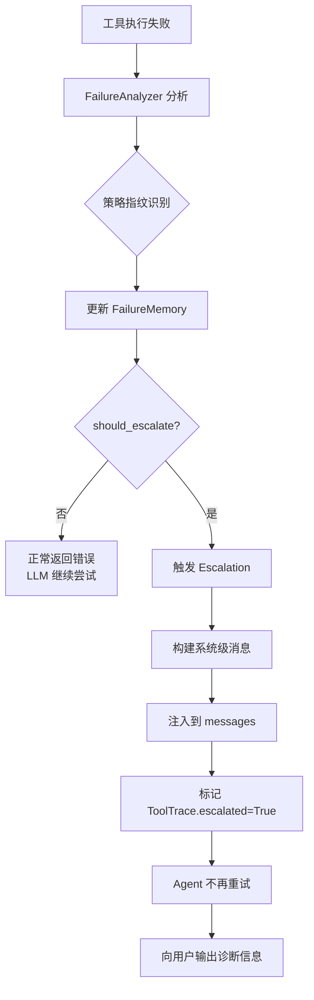

## 防止工具重复调用：选型演化全历程

这是一个跨越多个文件的演化故事，从最简单的去重到最终的语义级失败理解。

---

## 第一站：同轮去重（`seen_tool_sigs`）

**出现位置**：文件 4（`2026-05-14_22-54-19_7e0bc691.md`）轮次 1

### 原始问题

LLM 在一次响应中返回多个完全相同的 `tool_calls`：

```json
{
  "tool_calls": [
    {"name": "bash", "args": {"command": "ls -la"}},
    {"name": "bash", "args": {"command": "ls -la"}},  // 重复
    {"name": "bash", "args": {"command": "pwd"}}
  ]
}
```

这会浪费 token，执行冗余操作。

### 解决方案

```python
# src/agent/mini_claude_agent.py
seen_tool_sigs = set()
for tc in tool_calls:
    sig = (tc.name, json.dumps(tc.args, sort_keys=True))
    if sig in seen_tool_sigs:
        logger.warning(f"检测到重复工具调用，已自动跳过")
        continue  # 硬跳过，不执行
    seen_tool_sigs.add(sig)
    # 执行工具...
```

### 原理

- 签名 = `(tool_name, canonical_args)`
- `canonical_args`：`json.dumps(args, sort_keys=True)` 让 `{"b":1, "a":2}` 和 `{"a":2, "b":1}` 相同
- **作用域**：单次 LLM 响应内
- **行为**：硬跳过（不执行）

### 成果

解决了单次响应内的重复调用问题。

### 局限性

**不能解决跨轮重复**：
```
Turn 1: bash "python script.py" → 空输出
Turn 2: bash "python script.py" → 空输出  （相同命令）
Turn 3: bash "python script.py" → 空输出  （相同命令）
```

`seen_tool_sigs` 每轮重置，无能为力。

---

## 第二站：跨轮软提示（`_cmd_history`）

**出现位置**：文件 4（`2026-05-14_22-54-19_7e0bc691.md`）轮次 2

### 原始问题

你观察到日志中完全相同命令执行了两次，间隔 3 秒：

```
2026-04-27 21:55:46 - 执行工具【bash】，执行命令【python -c "with open('test.pdf', 'rb') as f:"】
2026-04-27 21:55:49 - 执行工具【bash】，执行命令【python -c "with open('test.pdf', 'rb') as f:"】
```

**根因**：命令没有输出 → LLM 看到空结果 → 无法判断发生了什么 → 重试

### 解决方案

```python
# src/agent/mini_claude_agent.py
self._cmd_history = []  # [(command, result_preview, iteration)]

# 工具执行后
cmd_sig = (tool_name, command_str, result_preview[:200])
self._cmd_history.append(cmd_sig)

# 检测连续 3 次相同
if len(self._cmd_history) >= 3:
    recent = self._cmd_history[-3:]
    if all(c[0] == recent[0][0] and c[1] == recent[0][1] for c in recent):
        # 触发软提示
        result += "\n\n[系统提示] 你已连续执行相同命令多次，且输出没有变化。"
        result += "如果这是轮询或重试操作请忽略；否则请考虑改变策略或使用不同参数。"
```

### 原理

- **检测条件**：连续 3 次 + 命令相同 + 结果相同
- **作用域**：跨多轮迭代
- **行为**：**软提示**（不拦截，只追加警告）
- **工具范围**：仅 `bash`

### 为什么是软提示而不是硬拦截？

你的明确要求：
> 不要硬拦截，因为轮询、重试等场景需要重复命令

### 成果

- Agent 收到提示后能改变策略
- 保留了轮询场景的灵活性

### 局限性

1. **LLM 可能忽略软提示**，继续重试
2. **只针对 bash**，其他工具不适用
3. **只检测连续重复**，不检测"换了参数但本质相同"的场景

---

## 第三站：硬拦截 + 强制反思（LoopGuard）

**出现位置**：文件 7（`2026-05-14_22-55-19_32021813.md`）轮次 6-10

### 原始问题

软提示被 LLM 忽略，Agent 仍然死循环。需要一个**更强硬的机制**。

### 解决方案

```python
# src/core/loop_guard.py
class LoopGuard:
    def __init__(self):
        self._last_sig = None
        self._recent_sigs = []  # 最近 N 次签名
        self._max_history = 10
    
    def check(self, tool_name: str, args: dict) -> Optional[str]:
        sig = (tool_name, json.dumps(args, sort_keys=True))
        
        # Rule 1: 连续重复
        if sig == self._last_sig:
            return self._build_intercept_message(tool_name, args)
        
        # Rule 2: 最近 3 次中出现 ≥2 次
        if self._recent_sigs.count(sig) >= 2:
            return self._build_intercept_message(tool_name, args)
        
        return None  # 允许执行
    
    def record(self, tool_name: str, args: dict):
        sig = (tool_name, json.dumps(args, sort_keys=True))
        self._last_sig = sig
        self._recent_sigs.append(sig)
        if len(self._recent_sigs) > self._max_history:
            self._recent_sigs.pop(0)
    
    def _build_intercept_message(self, tool_name, args) -> str:
        return f"""
⛔ [系统安全拦截 — 防死循环保护]
━━━━━━━━━━━━━━━━━━━━━━━━━━━━━━━━━━━━
检测到你正在重复使用相同的工具和参数：
  工具名称: {tool_name}
  调用参数: {json.dumps(args, ensure_ascii=False)}

该调用已被系统物理拦截——工具未被执行。

你必须在下一次回复中最先输出一个 <reflection> 标签，
深刻分析为什么之前的尝试会失败，
并想出一个与之前完全不同的新策略。
━━━━━━━━━━━━━━━━━━━━━━━━━━━━━━━━━━━━
"""
```

### 原理

| 维度     | 软提示           | LoopGuard                              |
| -------- | ---------------- | -------------------------------------- |
| 检测     | 连续 3 次相同    | 连续重复 OR 频率 ≥2/3                  |
| 行为     | 执行 + 提示      | **不执行，直接拦截**                   |
| 反馈     | "请考虑改变策略" | "必须输出 `<reflection>` 标签分析原因" |
| 工具范围 | 仅 bash          | **所有工具**                           |

### 成果

- 物理阻止重复调用
- 强制 LLM 进行元认知反思
- 覆盖所有工具类型

### 局限性（会在下一个阶段被发现）

LoopGuard 只能检测**完全相同参数**的重复。

无法检测：
```
pip install pygame
pip install pygame -i https://mirror.com  # 不同参数，同一策略
pip install pygame --timeout 120          # 不同参数，同一策略
```

---

## 第四站：语义级策略指纹（Failure Intelligence）

**出现位置**：文件 8（`2026-05-14_23-08-12_6fe6fc1a.md`）轮次 5

### 原始问题

LoopGuard 检测"完全相同参数"的重复，但 Agent 可能换参数做**同一件事**：

```
Turn 1: pip install pygame           → 网络超时
Turn 2: pip install pygame -i mirror → 网络超时  （换了镜像）
Turn 3: pip install pygame --timeout → 网络超时  （加了超时参数）
```

LoopGuard 认为三个调用都不同（参数不同），不会拦截。但从语义上看，Agent 一直在尝试 **NETWORK_PACKAGE_INSTALL** 这一种策略。

### 解决方案

```python
# src/core/failure_intelligence/signatures.py
class StrategyFingerprint(Enum):
    NETWORK_PACKAGE_INSTALL = "NETWORK_PACKAGE_INSTALL"
    LOCAL_FILE_WRITE = "LOCAL_FILE_WRITE"
    SHELL_NAVIGATION = "SHELL_NAVIGATION"
    CODE_EXECUTION = "CODE_EXECUTION"
    # ...

def infer_strategy_fingerprint(tool_name: str, args: dict) -> str:
    if tool_name == "bash":
        cmd = args.get("command", "")
        if "pip install" in cmd or "npm install" in cmd:
            return StrategyFingerprint.NETWORK_PACKAGE_INSTALL
        if "cd " in cmd:
            return StrategyFingerprint.SHELL_NAVIGATION
        if "python -c" in cmd or "node -e" in cmd:
            return StrategyFingerprint.CODE_EXECUTION
    # ...
```

### 升级策略

```python
# src/core/failure_intelligence/policy.py
def should_escalate(self, category: FailureCategory, 
                    count: int, 
                    diversity: int,
                    recoverability: Recoverability) -> Tuple[bool, str]:
    
    # 规则 1: 5 次以上强制升级
    if count >= 5:
        return True, f"同一失败类别已达 {count} 次"
    
    # 规则 2: 3 次 + 低策略多样性 + 需用户干预
    if count >= 3 and diversity < 2 and \
       recoverability == Recoverability.USER_INTERVENTION_REQUIRED:
        return True, f"尝试了 {diversity} 种策略均失败"
    
    # 规则 3: 不可恢复
    if recoverability == Recoverability.NON_RECOVERABLE:
        return True, "错误不可恢复"
    
    return False, ""
```

### 原理

```
传统检测（参数哈希）：
  "pip install pygame"                    → hash_A
  "pip install pygame -i mirror"          → hash_B  ← 不同！
  "pip install pygame --timeout 120"      → hash_C  ← 不同！

策略指纹检测：
  "pip install pygame"                    → NETWORK_PACKAGE_INSTALL
  "pip install pygame -i mirror"          → NETWORK_PACKAGE_INSTALL  ← 相同！
  "pip install pygame --timeout 120"      → NETWORK_PACKAGE_INSTALL  ← 相同！
```

### 成果

- 识别语义等效的重复（不同参数，同一策略）
- 第 3 次同策略失败 → 主动 escalation，不再盲目重试
- 向用户注入系统级 escalation 消息

---

## 完整演化路线图

```
阶段 1: 同轮去重 (seen_tool_sigs)
  问题: LLM 一次响应内重复调用
  方案: 签名集合 + 硬跳过
  局限: 不跨轮

        ↓

阶段 2: 跨轮软提示 (_cmd_history)
  问题: 跨轮重复执行相同命令
  方案: 连续 3 次 + 结果相同 → 追加提示
  局限: LLM 可能忽略，只覆盖 bash

        ↓

阶段 3: 硬拦截 + 强制反思 (LoopGuard)
  问题: 软提示被忽略，死循环依旧
  方案: 物理拦截 + 强制 <reflection>
  局限: 只检测完全相同参数

        ↓

阶段 4: 语义策略指纹 (Failure Intelligence)
  问题: 换参数但本质相同，LoopGuard 无法检测
  方案: 策略指纹 + 多样性检测 + escalation
  成果: 语义级重复理解
```

---

## 面试可以这样讲

> "我们在防止工具重复调用上经历了 4 个阶段的演进。
>
> 第一阶段做了同轮去重，解决 LLM 一次响应内重复调用的问题。
>
> 第二阶段发现跨轮重复更严重，尤其是 bash 空输出导致的重试死循环。我们做了连续 3 次的软提示。
>
> 但软提示可能被忽略，所以第三阶段升级为 LoopGuard，硬拦截 + 强制输出 reflection 标签。
>
> 第四阶段发现最隐蔽的问题：Agent 换着参数做同一件事。我们引入了策略指纹，把 'pip install' 不同参数识别为同一策略，达到 3 次就主动 escalation。
>
> 现在 Agent 不会在同一个策略上无限浪费轮数了。"

---

这个流程讲的挺好的，第四阶段escalation后会怎么样吗

## 第四阶段：Escalation 之后发生了什么

这是一个很好的追问。在第四阶段的设计中，**escalation 不是终点，而是"让出控制权"的决策点**。

---

### Escalation 的完整流程



---

### Escalation 消息的具体内容

当达到升级条件时，系统**不返回工具执行结果**，而是返回一条**系统级 escalation 消息**：

```python
# src/core/failure_intelligence/policy.py
def build_escalation_message(
    category: FailureCategory,
    count: int,
    diversity: int,
    root_cause_hint: str,
    tool_name: str
) -> str:
    return f"""
╔════════════════════════════════════════════════════════════╗
║ [系统级 Escalation — Failure Intelligence]                ║
╠════════════════════════════════════════════════════════════╣
║ 失败类型: {category.value}                                 ║
║ 根因分析: {root_cause_hint}                               ║
║                                                            ║
║ 统计信息:                                                 ║
║   · 同类失败次数: {count}                                  ║
║   · 尝试的策略种类: {diversity}                            ║
║                                                            ║
║ ⚠️ Runtime 判断: 继续重试大概率无效                        ║
║                                                            ║
║ 建议操作:                                                 ║
║   · 检查网络/环境配置                                      ║
║   · 确认依赖源是否可用                                     ║
║   · 或使用不同的安装方式（如本地包）                       ║
║                                                            ║
║ 此轮对话中，系统将不再自动重试该操作。                     ║
╚════════════════════════════════════════════════════════════╝
"""
```

---

### Escalation 后的系统行为

| 层次           | 行为                                     |
| -------------- | ---------------------------------------- |
| **工具层**     | 不执行真实工具，直接返回 escalation 消息 |
| **Agent Loop** | 该消息作为 `tool_result` 进入对话历史    |
| **LLM 行为**   | 收到 escalation 后，LLM 应该：           |
- 停止当前失败策略
- 向用户说明情况
- 提出替代方案或请求人工介入 |
| **Trace 记录** | `ToolTrace.escalated = True`，`final_status` 可能为 `FAILED` |
| **后续重试** | 同类失败不会再次触发 escalation（已标记） |

---

### 实际案例：pip install 网络超时

**传统行为（无 FI）**：
```
Turn 1: pip install pygame → 网络超时
Turn 2: pip install pygame -i mirror1 → 网络超时
Turn 3: pip install pygame -i mirror2 → 网络超时
...
Turn 34: 达到 max_iterations → 放弃
```

**FI 行为**：
```
Turn 1: pip install pygame → 网络超时
  → 分类: NETWORK_UNREACHABLE, 策略: NETWORK_PACKAGE_INSTALL
  → memory: count=1, diversity=1

Turn 2: pip install pygame -i mirror → 网络超时
  → 分类: NETWORK_UNREACHABLE, 策略: NETWORK_PACKAGE_INSTALL (相同)
  → memory: count=2, diversity=1

Turn 3: pip install pygame --timeout 120 → 网络超时
  → 分类: NETWORK_UNREACHABLE, 策略: NETWORK_PACKAGE_INSTALL (相同)
  → memory: count=3, diversity=1
  → should_escalate? YES (count>=3 AND diversity<2)

  → 注入 escalation 消息
  → Agent 收到后向用户输出：
     "检测到网络持续不可达，已尝试 3 种镜像均失败，
      建议您检查网络或手动下载依赖包。"

Turn 4: 不再重试 pip install，转向其他策略或等待用户指令
```

---

### Escalation 与 断路器（Circuit Breaker）的区别

| 维度     | 断路器           | FI Escalation                       |
| -------- | ---------------- | ----------------------------------- |
| 触发条件 | 错误率阈值       | 语义理解（同类失败 + 策略单一）     |
| 行为     | 熔断（禁止调用） | **让出控制权**（告知 LLM 不要再试） |
| 恢复     | 超时后半开       | 由 LLM 决策何时恢复                 |
| 粒度     | 服务/接口级      | 任务/策略级                         |

**核心区别**：FI escalation 不是"锁死"，而是"智能建议"——Agent 仍然可以选择继续，但需要明确的理由。

---

### Escalation 后 Agent 的实际响应（示例）

当 escalation 消息注入后，一个"聪明"的 Agent 会这样响应：

```
用户: 帮我安装 pygame

Agent: 我尝试安装 pygame，但遇到持续的网络问题。
       已尝试使用默认源、清华镜像、以及增加超时时间，
       均返回网络不可达错误。

       ⚠️ 系统提示：这可能是环境网络问题，继续重试大概率无效。

       建议：
       1. 请检查您的网络连接
       2. 或者提供本地 wheel 文件进行安装
       3. 或者我可以尝试其他包管理方式（如 conda）

       您希望我怎么处理？
```

---

### 这个设计的局限性（文件 8 审计报告指出）

1. **Escalation 后没有强制停止机制**
   - LLM 可能**忽略** escalation 消息继续重试
   - 这是一个"软 escalation"，不是硬熔断

2. **策略指纹规则需要人工维护**
   - `NETWORK_PACKAGE_INSTALL` 匹配 `pip install`、`npm install` 等
   - 新的包管理器需要手动添加规则

3. **没有用户确认环节**
   - 系统直接 escalation，没有先询问用户"要放弃吗？"
   - 这可能过于激进

---

### 如果要进一步演进（面试可以说）

> "当前 escalation 是**单向告知**，下一步可以做：
>
> 1. **用户确认门**：escalation 前先问用户'是否继续重试？'
> 2. **策略推荐**：基于失败类型，主动建议替代方案（如'要不要试试 conda？'）
> 3. **学习机制**：记录哪些场景下 escalation 后用户选择了什么，用于优化阈值"

---

**总结**：Escalation 的本质是 **Runtime 理解失败模式后，主动让出控制权**，而不是盲目重试或简单熔断。这比传统断路器更"智能"，但仍依赖 LLM 的正确响应。
