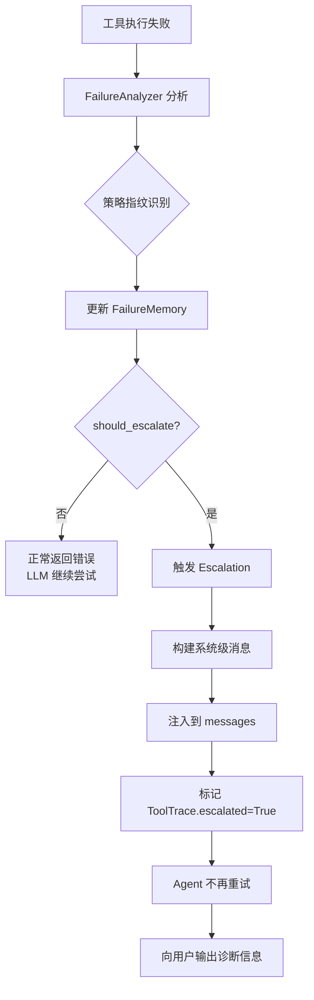

## 防止工具重复调用：选型演化全历程

这是一个跨越多个文件的演化故事，从最简单的去重到最终的语义级失败理解。

---

## 第一站：同轮去重（`seen_tool_sigs`）

**出现位置**：文件 4（`2026-05-14_22-54-19_7e0bc691.md`）轮次 1

### 原始问题

LLM 在一次响应中返回多个完全相同的 `tool_calls`：

```json
{
  "tool_calls": [
    {"name": "bash", "args": {"command": "ls -la"}},
    {"name": "bash", "args": {"command": "ls -la"}},  // 重复
    {"name": "bash", "args": {"command": "pwd"}}
  ]
}
```

这会浪费 token，执行冗余操作。

### 解决方案

```python
# src/agent/mini_claude_agent.py
seen_tool_sigs = set()
for tc in tool_calls:
    sig = (tc.name, json.dumps(tc.args, sort_keys=True))
    if sig in seen_tool_sigs:
        logger.warning(f"检测到重复工具调用，已自动跳过")
        continue  # 硬跳过，不执行
    seen_tool_sigs.add(sig)
    # 执行工具...
```

### 原理

- 签名 = `(tool_name, canonical_args)`
- `canonical_args`：`json.dumps(args, sort_keys=True)` 让 `{"b":1, "a":2}` 和 `{"a":2, "b":1}` 相同
- **作用域**：单次 LLM 响应内
- **行为**：硬跳过（不执行）

### 成果

解决了单次响应内的重复调用问题。

### 局限性

**不能解决跨轮重复**：
```
Turn 1: bash "python script.py" → 空输出
Turn 2: bash "python script.py" → 空输出  （相同命令）
Turn 3: bash "python script.py" → 空输出  （相同命令）
```

`seen_tool_sigs` 每轮重置，无能为力。

---

## 第二站：跨轮软提示（`_cmd_history`）

**出现位置**：文件 4（`2026-05-14_22-54-19_7e0bc691.md`）轮次 2

### 原始问题

你观察到日志中完全相同命令执行了两次，间隔 3 秒：

```
2026-04-27 21:55:46 - 执行工具【bash】，执行命令【python -c "with open('test.pdf', 'rb') as f:"】
2026-04-27 21:55:49 - 执行工具【bash】，执行命令【python -c "with open('test.pdf', 'rb') as f:"】
```

**根因**：命令没有输出 → LLM 看到空结果 → 无法判断发生了什么 → 重试

### 解决方案

```python
# src/agent/mini_claude_agent.py
self._cmd_history = []  # [(command, result_preview, iteration)]

# 工具执行后
cmd_sig = (tool_name, command_str, result_preview[:200])
self._cmd_history.append(cmd_sig)

# 检测连续 3 次相同
if len(self._cmd_history) >= 3:
    recent = self._cmd_history[-3:]
    if all(c[0] == recent[0][0] and c[1] == recent[0][1] for c in recent):
        # 触发软提示
        result += "\n\n[系统提示] 你已连续执行相同命令多次，且输出没有变化。"
        result += "如果这是轮询或重试操作请忽略；否则请考虑改变策略或使用不同参数。"
```

### 原理

- **检测条件**：连续 3 次 + 命令相同 + 结果相同
- **作用域**：跨多轮迭代
- **行为**：**软提示**（不拦截，只追加警告）
- **工具范围**：仅 `bash`

### 为什么是软提示而不是硬拦截？

你的明确要求：
> 不要硬拦截，因为轮询、重试等场景需要重复命令

### 成果

- Agent 收到提示后能改变策略
- 保留了轮询场景的灵活性

### 局限性

1. **LLM 可能忽略软提示**，继续重试
2. **只针对 bash**，其他工具不适用
3. **只检测连续重复**，不检测"换了参数但本质相同"的场景

---

## 第三站：硬拦截 + 强制反思（LoopGuard）

**出现位置**：文件 7（`2026-05-14_22-55-19_32021813.md`）轮次 6-10

### 原始问题

软提示被 LLM 忽略，Agent 仍然死循环。需要一个**更强硬的机制**。

### 解决方案

```python
# src/core/loop_guard.py
class LoopGuard:
    def __init__(self):
        self._last_sig = None
        self._recent_sigs = []  # 最近 N 次签名
        self._max_history = 10
    
    def check(self, tool_name: str, args: dict) -> Optional[str]:
        sig = (tool_name, json.dumps(args, sort_keys=True))
        
        # Rule 1: 连续重复
        if sig == self._last_sig:
            return self._build_intercept_message(tool_name, args)
        
        # Rule 2: 最近 3 次中出现 ≥2 次
        if self._recent_sigs.count(sig) >= 2:
            return self._build_intercept_message(tool_name, args)
        
        return None  # 允许执行
    
    def record(self, tool_name: str, args: dict):
        sig = (tool_name, json.dumps(args, sort_keys=True))
        self._last_sig = sig
        self._recent_sigs.append(sig)
        if len(self._recent_sigs) > self._max_history:
            self._recent_sigs.pop(0)
    
    def _build_intercept_message(self, tool_name, args) -> str:
        return f"""
⛔ [系统安全拦截 — 防死循环保护]
━━━━━━━━━━━━━━━━━━━━━━━━━━━━━━━━━━━━
检测到你正在重复使用相同的工具和参数：
  工具名称: {tool_name}
  调用参数: {json.dumps(args, ensure_ascii=False)}

该调用已被系统物理拦截——工具未被执行。

你必须在下一次回复中最先输出一个 <reflection> 标签，
深刻分析为什么之前的尝试会失败，
并想出一个与之前完全不同的新策略。
━━━━━━━━━━━━━━━━━━━━━━━━━━━━━━━━━━━━
"""
```

### 原理

| 维度     | 软提示           | LoopGuard                              |
| -------- | ---------------- | -------------------------------------- |
| 检测     | 连续 3 次相同    | 连续重复 OR 频率 ≥2/3                  |
| 行为     | 执行 + 提示      | **不执行，直接拦截**                   |
| 反馈     | "请考虑改变策略" | "必须输出 `<reflection>` 标签分析原因" |
| 工具范围 | 仅 bash          | **所有工具**                           |

### 成果

- 物理阻止重复调用
- 强制 LLM 进行元认知反思
- 覆盖所有工具类型

### 局限性（会在下一个阶段被发现）

LoopGuard 只能检测**完全相同参数**的重复。

无法检测：
```
pip install pygame
pip install pygame -i https://mirror.com  # 不同参数，同一策略
pip install pygame --timeout 120          # 不同参数，同一策略
```

---

## 第四站：语义级策略指纹（Failure Intelligence）

**出现位置**：文件 8（`2026-05-14_23-08-12_6fe6fc1a.md`）轮次 5

### 原始问题

LoopGuard 检测"完全相同参数"的重复，但 Agent 可能换参数做**同一件事**：

```
Turn 1: pip install pygame           → 网络超时
Turn 2: pip install pygame -i mirror → 网络超时  （换了镜像）
Turn 3: pip install pygame --timeout → 网络超时  （加了超时参数）
```

LoopGuard 认为三个调用都不同（参数不同），不会拦截。但从语义上看，Agent 一直在尝试 **NETWORK_PACKAGE_INSTALL** 这一种策略。

### 解决方案

```python
# src/core/failure_intelligence/signatures.py
class StrategyFingerprint(Enum):
    NETWORK_PACKAGE_INSTALL = "NETWORK_PACKAGE_INSTALL"
    LOCAL_FILE_WRITE = "LOCAL_FILE_WRITE"
    SHELL_NAVIGATION = "SHELL_NAVIGATION"
    CODE_EXECUTION = "CODE_EXECUTION"
    # ...

def infer_strategy_fingerprint(tool_name: str, args: dict) -> str:
    if tool_name == "bash":
        cmd = args.get("command", "")
        if "pip install" in cmd or "npm install" in cmd:
            return StrategyFingerprint.NETWORK_PACKAGE_INSTALL
        if "cd " in cmd:
            return StrategyFingerprint.SHELL_NAVIGATION
        if "python -c" in cmd or "node -e" in cmd:
            return StrategyFingerprint.CODE_EXECUTION
    # ...
```

### 升级策略

```python
# src/core/failure_intelligence/policy.py
def should_escalate(self, category: FailureCategory, 
                    count: int, 
                    diversity: int,
                    recoverability: Recoverability) -> Tuple[bool, str]:
    
    # 规则 1: 5 次以上强制升级
    if count >= 5:
        return True, f"同一失败类别已达 {count} 次"
    
    # 规则 2: 3 次 + 低策略多样性 + 需用户干预
    if count >= 3 and diversity < 2 and \
       recoverability == Recoverability.USER_INTERVENTION_REQUIRED:
        return True, f"尝试了 {diversity} 种策略均失败"
    
    # 规则 3: 不可恢复
    if recoverability == Recoverability.NON_RECOVERABLE:
        return True, "错误不可恢复"
    
    return False, ""
```

### 原理

```
传统检测（参数哈希）：
  "pip install pygame"                    → hash_A
  "pip install pygame -i mirror"          → hash_B  ← 不同！
  "pip install pygame --timeout 120"      → hash_C  ← 不同！

策略指纹检测：
  "pip install pygame"                    → NETWORK_PACKAGE_INSTALL
  "pip install pygame -i mirror"          → NETWORK_PACKAGE_INSTALL  ← 相同！
  "pip install pygame --timeout 120"      → NETWORK_PACKAGE_INSTALL  ← 相同！
```

### 成果

- 识别语义等效的重复（不同参数，同一策略）
- 第 3 次同策略失败 → 主动 escalation，不再盲目重试
- 向用户注入系统级 escalation 消息

---

## 完整演化路线图

```
阶段 1: 同轮去重 (seen_tool_sigs)
  问题: LLM 一次响应内重复调用
  方案: 签名集合 + 硬跳过
  局限: 不跨轮

        ↓

阶段 2: 跨轮软提示 (_cmd_history)
  问题: 跨轮重复执行相同命令
  方案: 连续 3 次 + 结果相同 → 追加提示
  局限: LLM 可能忽略，只覆盖 bash

        ↓

阶段 3: 硬拦截 + 强制反思 (LoopGuard)
  问题: 软提示被忽略，死循环依旧
  方案: 物理拦截 + 强制 <reflection>
  局限: 只检测完全相同参数

        ↓

阶段 4: 语义策略指纹 (Failure Intelligence)
  问题: 换参数但本质相同，LoopGuard 无法检测
  方案: 策略指纹 + 多样性检测 + escalation
  成果: 语义级重复理解
```

---

## 面试可以这样讲

> "我们在防止工具重复调用上经历了 4 个阶段的演进。
>
> 第一阶段做了同轮去重，解决 LLM 一次响应内重复调用的问题。
>
> 第二阶段发现跨轮重复更严重，尤其是 bash 空输出导致的重试死循环。我们做了连续 3 次的软提示。
>
> 但软提示可能被忽略，所以第三阶段升级为 LoopGuard，硬拦截 + 强制输出 reflection 标签。
>
> 第四阶段发现最隐蔽的问题：Agent 换着参数做同一件事。我们引入了策略指纹，把 'pip install' 不同参数识别为同一策略，达到 3 次就主动 escalation。
>
> 现在 Agent 不会在同一个策略上无限浪费轮数了。"

---

这个流程讲的挺好的，第四阶段escalation后会怎么样吗

## 第四阶段：Escalation 之后发生了什么

这是一个很好的追问。在第四阶段的设计中，**escalation 不是终点，而是"让出控制权"的决策点**。

---

### Escalation 的完整流程



---

### Escalation 消息的具体内容

当达到升级条件时，系统**不返回工具执行结果**，而是返回一条**系统级 escalation 消息**：

```python
# src/core/failure_intelligence/policy.py
def build_escalation_message(
    category: FailureCategory,
    count: int,
    diversity: int,
    root_cause_hint: str,
    tool_name: str
) -> str:
    return f"""
╔════════════════════════════════════════════════════════════╗
║ [系统级 Escalation — Failure Intelligence]                ║
╠════════════════════════════════════════════════════════════╣
║ 失败类型: {category.value}                                 ║
║ 根因分析: {root_cause_hint}                               ║
║                                                            ║
║ 统计信息:                                                 ║
║   · 同类失败次数: {count}                                  ║
║   · 尝试的策略种类: {diversity}                            ║
║                                                            ║
║ ⚠️ Runtime 判断: 继续重试大概率无效                        ║
║                                                            ║
║ 建议操作:                                                 ║
║   · 检查网络/环境配置                                      ║
║   · 确认依赖源是否可用                                     ║
║   · 或使用不同的安装方式（如本地包）                       ║
║                                                            ║
║ 此轮对话中，系统将不再自动重试该操作。                     ║
╚════════════════════════════════════════════════════════════╝
"""
```

---

### Escalation 后的系统行为

| 层次           | 行为                                     |
| -------------- | ---------------------------------------- |
| **工具层**     | 不执行真实工具，直接返回 escalation 消息 |
| **Agent Loop** | 该消息作为 `tool_result` 进入对话历史    |
| **LLM 行为**   | 收到 escalation 后，LLM 应该：           |
- 停止当前失败策略
- 向用户说明情况
- 提出替代方案或请求人工介入 |
| **Trace 记录** | `ToolTrace.escalated = True`，`final_status` 可能为 `FAILED` |
| **后续重试** | 同类失败不会再次触发 escalation（已标记） |

---

### 实际案例：pip install 网络超时

**传统行为（无 FI）**：
```
Turn 1: pip install pygame → 网络超时
Turn 2: pip install pygame -i mirror1 → 网络超时
Turn 3: pip install pygame -i mirror2 → 网络超时
...
Turn 34: 达到 max_iterations → 放弃
```

**FI 行为**：
```
Turn 1: pip install pygame → 网络超时
  → 分类: NETWORK_UNREACHABLE, 策略: NETWORK_PACKAGE_INSTALL
  → memory: count=1, diversity=1

Turn 2: pip install pygame -i mirror → 网络超时
  → 分类: NETWORK_UNREACHABLE, 策略: NETWORK_PACKAGE_INSTALL (相同)
  → memory: count=2, diversity=1

Turn 3: pip install pygame --timeout 120 → 网络超时
  → 分类: NETWORK_UNREACHABLE, 策略: NETWORK_PACKAGE_INSTALL (相同)
  → memory: count=3, diversity=1
  → should_escalate? YES (count>=3 AND diversity<2)

  → 注入 escalation 消息
  → Agent 收到后向用户输出：
     "检测到网络持续不可达，已尝试 3 种镜像均失败，
      建议您检查网络或手动下载依赖包。"

Turn 4: 不再重试 pip install，转向其他策略或等待用户指令
```

---

### Escalation 与 断路器（Circuit Breaker）的区别

| 维度     | 断路器           | FI Escalation                       |
| -------- | ---------------- | ----------------------------------- |
| 触发条件 | 错误率阈值       | 语义理解（同类失败 + 策略单一）     |
| 行为     | 熔断（禁止调用） | **让出控制权**（告知 LLM 不要再试） |
| 恢复     | 超时后半开       | 由 LLM 决策何时恢复                 |
| 粒度     | 服务/接口级      | 任务/策略级                         |

**核心区别**：FI escalation 不是"锁死"，而是"智能建议"——Agent 仍然可以选择继续，但需要明确的理由。

---

### Escalation 后 Agent 的实际响应（示例）

当 escalation 消息注入后，一个"聪明"的 Agent 会这样响应：

```
用户: 帮我安装 pygame

Agent: 我尝试安装 pygame，但遇到持续的网络问题。
       已尝试使用默认源、清华镜像、以及增加超时时间，
       均返回网络不可达错误。

       ⚠️ 系统提示：这可能是环境网络问题，继续重试大概率无效。

       建议：
       1. 请检查您的网络连接
       2. 或者提供本地 wheel 文件进行安装
       3. 或者我可以尝试其他包管理方式（如 conda）

       您希望我怎么处理？
```

---

### 这个设计的局限性（文件 8 审计报告指出）

1. **Escalation 后没有强制停止机制**
   - LLM 可能**忽略** escalation 消息继续重试
   - 这是一个"软 escalation"，不是硬熔断

2. **策略指纹规则需要人工维护**
   - `NETWORK_PACKAGE_INSTALL` 匹配 `pip install`、`npm install` 等
   - 新的包管理器需要手动添加规则

3. **没有用户确认环节**
   - 系统直接 escalation，没有先询问用户"要放弃吗？"
   - 这可能过于激进

---

### 如果要进一步演进（面试可以说）

> "当前 escalation 是**单向告知**，下一步可以做：
>
> 1. **用户确认门**：escalation 前先问用户'是否继续重试？'
> 2. **策略推荐**：基于失败类型，主动建议替代方案（如'要不要试试 conda？'）
> 3. **学习机制**：记录哪些场景下 escalation 后用户选择了什么，用于优化阈值"

---

**总结**：Escalation 的本质是 **Runtime 理解失败模式后，主动让出控制权**，而不是盲目重试或简单熔断。这比传统断路器更"智能"，但仍依赖 LLM 的正确响应。

---

## 第五站：‑c 内容哈希 + 阈值提优（精细化调优）

**对应版本**：v7_fix_loop_prevention（ADR-015）

### 原始问题

第四站的 CommandNormalizer 将 `python -c "compile('a.py')"` 和 `python -c "compile('b.py')"` 都归一化为 `EXECUTE::-c`。连续对不同文件执行 `python -c` 语法校验时，第 3 个被 V3LoopGuard 误拦截，导致额外消耗 ~8,452 tokens 用临时脚本绕过。

### 解决方案

```python
# src/core/loop_controller.py — _extract_target()
if action == "EXECUTE" and " -c " in cmd:
    # 从 -c 后面的参数中截取一部分计算 hash，加入 intent_key
    import hashlib
    idx = cmd.index(" -c ") + 4
    content = cmd[idx:].strip().strip("\"'")
    content_hash = hashlib.md5(content.encode()).hexdigest()[:8]
    target = f"-c:{content_hash}"
```

同时升级三项配套：

| # | 改动 | 效果 |
|---|------|------|
| 1 | `min_occurrences: 2 → 3` | 需要 4 次同意图才拦截（原 3 次），降低 LLM 随机性敏感度 |
| 2 | V3 拦截消息复用 Legacy `<reflection>` 模板 | 被拦截后 LLM 必须输出反思标签 |
| 3 | `loop_controller.clear()` 在 cycle 开始时调用 | 每次独立任务重置计数器，消除跨任务残留 |

### 成果

- `python -c` 跨文件编译不再被误拦截
- LoopGuard 触发归零（v6.5 均值 1 → v7 均值 0）
- 工具命中率 100%，工具失败次数归零
- 用四项精确调优（而非架构重写）修复了 audit 报告指出的所有问题

### 完整演化路线图（更新版）

```
阶段 1: 同轮去重 (seen_tool_sigs)
  问题: LLM 一次响应内重复调用
  方案: 签名集合 + 硬跳过
  局限: 不跨轮

        ↓

阶段 2: 跨轮软提示 (_cmd_history)
  问题: 跨轮重复执行相同命令
  方案: 连续 3 次 + 结果相同 → 追加提示
  局限: LLM 可能忽略，只覆盖 bash

        ↓

阶段 3: 硬拦截 + 强制反思 (LoopGuard)
  问题: 软提示被忽略，死循环依旧
  方案: 物理拦截 + 强制 <reflection>
  局限: 只检测完全相同参数

        ↓

阶段 4: 语义策略指纹 (Failure Intelligence)
  问题: 换参数但本质相同，LoopGuard 无法检测
  方案: 策略指纹 + 多样性检测 + escalation
  成果: 语义级重复理解

        ↓

阶段 5: ‑c 内容哈希 + 阈值提优 (精细化调优)
  问题: ‑c 参数内容被归一化丢弃，跨文件编译误杀
  方案: 内容哈希加入意图键 + 阈值 2→3 + 反思恢复 + 计数器重置
  成果: LoopGuard 触发归零，命中率 100%，四项调优全部验证
```

## 第六站：放宽 Windows 命令与方框式拦截

### 观察到的问题

在 Windows 项目中，下面这些都是正常命令写法：

```text
java -version 2>&1
dir /b 2>nul
echo first & echo second
```

但旧策略把所有单独的 `&` 都当成后台运行，导致正常的错误重定向和命令连接被拦截。与此同时，V3 LoopGuard 在最近 5 次调用中同一意图出现 3 次就直接显示一个很强硬的方框，并要求模型必须输出 `<reflection>`。

真实日志还暴露了一个更具体的误判：

```text
java -version
mvn -version
```

两个命令被归一化成了同一个 `bash:EXECUTE:-version`，导致 `mvn -version` 被当成重复操作拦截。

### 本轮修改

1. `CommandPolicy` 现在允许：
   - `2>&1`、`2>nul` 等重定向；
   - `command-a & command-b` 这样的 Windows 命令连接。
2. 仍然拦截命令末尾单独的 `&`，避免无约束后台运行。
3. Windows 平台提示词不再禁止所有 `&`，而是明确说明连接和重定向可以使用。
4. LoopController 在没有明确目标参数时，把可执行程序也放进指纹，避免 `java -version` 和 `mvn -version` 冲突。
5. V3 LoopGuard 的触发条件从“最近 5 次中重复 3 次”放宽为“最近 6 次中先前重复 4 次后才拦截”。
6. 方框提示改成普通的“重复操作提醒”，不再强制模型输出 `<reflection>`，只告诉模型本次调用未执行，由模型自行判断下一步。

### 保留的安全边界

这次没有把所有命令都放开。远程内容直接管道到 Shell、破坏性文件操作、编码 PowerShell、`cmd /c`、`start` 等高风险行为仍然由命令策略拦截。目标是减少正常 Windows 工作流的误伤，不是取消 workspace 和命令安全边界。

### 验证结果

新增并通过了 Windows 重定向/命令连接测试，以及 `java -version` 与 `mvn -version` 指纹区分测试。相关测试共 56 个通过。

后续还需要用真实 Windows 项目观察两件事：正常重复轮询是否被过晚放行，以及真正的死循环是否仍能在不依赖强制反思提示的情况下及时停止。

## 第七站：普通 Windows 命令放行与长时间服务后台化

### 这次从哪里发现问题

最新一次真实会话使用 Redis 项目时，没有看到 CommandPolicy 把 `java`、`where`、`netstat | findstr` 或 `start` 拦截；这些命令的 `tool_result` 都是 `blocked=false`。但代码检查发现仍有两处隐形限制：

1. Agent 的 `_handle_bash` 会把以 `grep`、`findstr`、`Select-String` 开头的命令直接改成提示，不经过正常 Shell。
2. CommandPolicy 会拦截 `cmd /c`、带参数的 `start` 和所有 `$()`/反引号语法。它们并不天然危险，尤其是 Windows 工具包装和 PowerShell 语法，继续增加例外名单只会越来越难维护。

### Redis 为什么会卡住

会话中 Agent 用普通 `bash` 执行了 Redis 服务端启动命令。服务端本来就会一直运行，所以 Shell 工具一直等待；用户按 `Ctrl+C` 后，当前轮才被取消。后续 Agent 又尝试了 Linux 风格的 `--daemonize yes`，这在 Windows Redis 场景下不可靠，且验证时服务没有真正监听 6379。

### 本轮修改

- 命令策略改成更窄的危险规则：保留提权 `runas`、破坏性文件操作、远程内容直接管道到 Shell、编码/动态 PowerShell 等拦截；放行普通 `cmd /c`、`start /b`、PowerShell `$()`、反引号和普通搜索命令。
- 删除 `_handle_bash` 对 `grep/findstr/Select-String` 的强制拦截。`search_code` 仍然是推荐工具，但不再把推荐写成硬限制。
- 暴露已有的后台执行器为 `run_background` 工具。它会继承当前工作目录、立即返回任务 ID，适用于 Redis、Spring Boot、前端 dev server 等持续运行的服务。
- Windows 系统提示词明确：长时间服务使用 `run_background`，启动后再用 `bash` 做健康检查，不使用 Linux 专属 daemon 参数。

### 为什么选择新增后台工具

直接让 Agent 猜 `start`、`&` 或平台特定的 daemon 参数，无法保证不同 Windows 命令都能正确工作。显式的 `run_background` 只改变执行方式，不改变普通 `bash` 的同步语义，也让“启动服务”和“验证服务”成为两个可观察步骤。

### 还需要观察什么

- Agent 是否真的会在服务启动场景选择 `run_background`。
- Redis 进程是否能在后台任务中持续运行，并在下一轮被 `redis-cli ping` 或端口检查发现。
- 用户退出 Agent 后，后台服务是否需要单独提供停止命令；这属于后续的进程生命周期管理，不在本轮扩大范围。

## 第八站：为 Windows `start` 增加运行时兜底

### 新会话再次暴露的问题

代码已经提供了 `run_background`，但真实会话中模型仍然生成了：

```text
start "RedisLimitDemo" /D "D:\02_study\code\JavaProject\redis-limit-demo" mvnw.cmd spring-boot:run
```

它确实打开了一个新的终端窗口，窗口里 Spring Boot 也在正常打印启动信息；但是原来的 `bash` 工具调用仍然没有返回。对 Agent 来说，这一轮一直处于“工具执行中”，所以用户只能按 `Ctrl+C` 取消。

### 为什么只靠提示词不够

系统提示词只能告诉模型“长时间服务应该使用 `run_background`”，不能保证模型每次都选择正确工具。这个案例中模型认为 Windows `start` 已经是后台启动，因此没有调用新增工具。

### 本轮修改

在 Windows 的 `_handle_bash` 入口增加一个非常窄的兜底：如果命令以 `start` 开头，就保留原命令、当前工作目录和参数，直接提交给后台执行器。其他普通 `bash` 命令不改变执行方式。

这样即使模型继续生成 `bash start ...`，Harness 也不会等待这个服务进程，而是立即返回后台任务 ID；Agent 可以继续检查端口、调用 `redis-cli ping` 或访问 Spring Boot 接口。

### 这不是全面改成异步

只有明确使用 Windows `start` 的命令会走兜底，普通编译、测试、查询命令仍然是同步执行。后台服务的停止和生命周期管理仍未补齐，后续需要单独考虑。

## 第九站：把后台服务从 Agent 生命周期中解耦

### 真实会话发现的问题

最新 session 中，Spring Boot 后台任务 `dc5d9075` 被记录为 `failed`，但同一轮检查发现：

- Java 进程 PID `63988` 仍然存在；
- 8081 端口正在监听；
- `/api/public/info` 返回 HTTP 200。

这说明“启动命令本身的退出状态”和“服务是否健康”不是同一个指标。尤其是 `mvnw.cmd spring-boot:run` 可能启动子进程后自身结束，不能只看 Maven 包装进程的退出码。

### 设计取舍

Agent 退出时不自动停止 Java、Redis 等后台服务。用户可能只是让 Agent 帮忙启动服务，服务应该继续独立运行；停止动作必须是用户或 Agent 通过明确的 `stop_background(job_id)` 主动执行。

### 本轮修改

后台执行器从等待 `subprocess.run()` 改成独立的 `Popen` 进程记录，并为每个任务保存：

- `job_id`、PID、启动时间、工作目录；
- 进程状态、退出码和结束时间；
- 独立的 stdout/stderr 文件；
- 任务尾部日志读取能力。

新增四个 Agent 工具：

- `get_background_status(job_id)`：查看进程状态；
- `get_background_logs(job_id, tail)`：读取最近几行输出；
- `stop_background(job_id)`：显式停止进程树；
- `health_check(job_id, port, url)`：独立检查端口或 HTTP 服务。

`run_background` 现在返回结构化信息，包括 `async_launched`、job ID、PID、启动时间、工作目录和日志文件路径。

### 为什么健康检查单独存在

“进程还活着”不代表服务已经能用，“启动命令退出”也不代表服务一定不可用。端口、HTTP 状态码和业务接口响应才是服务健康的判断依据，因此任务状态和健康检查结果不能合并成一个字段。

### 当前边界

后台任务状态暂存在当前 Agent 进程内，日志文件位于统一运行数据目录。Agent 退出不会杀掉外部进程，但退出后当前 Agent 不再主动监控这些进程；后续如果需要跨会话查看，需要持久化任务清单和进程信息。

`run_background` 保留了 `timeout` 字段以兼容旧接口，但现在不会因为时间到了就自动杀掉进程。这样 Redis、Spring Boot 和开发服务器不会因为 Agent 的工具超时被误停；真正需要停止时，使用 `stop_background(job_id)`。

## 第十站：工具长输出文件化与渐进式读取

### 背景

`task_013_large_log_debug` 的测试程序会产生约 147,000 个字符的输出。原来的 `ShellSession` 会在 50,000 个字符处直接截断，而且截断发生在工具结果返回之前。这样模型既拿不到完整日志，也没有一个稳定的文件路径可以继续查看。

基线评测 5 次全部通过，但 Token 从 39,034 波动到 271,198。部分运行中 Agent 自己把输出重定向到文件，说明模型能临时绕开问题，但这不能保证所有长输出都有同样的处理方式。

### 本轮修改

- 去掉 `ShellSession` 的 50,000 字符硬截断，先保留完整命令输出。
- 在 `BaseTools` 增加统一的长输出处理：超过 40 行或 2,000 字符时，把完整内容保存到工作区的 `.agent/logs/cmd_<timestamp>_<id>.log`。
- 返回给模型的内容只保留退出码、总行数和字符数、前 10 行、后 20 行，以及日志文件的相对路径。
- 返回提示明确建议使用 `read_file` 的行号范围或 `search_code` 检索日志。
- `get_background_logs` 也复用同一处理逻辑，避免后台日志尾部过长时再次把上下文撑大。
- `compare_reports.py` 增加 `Peak Turn Tokens`，从每轮 trace 的 `token_usage` 中取最大值。
- 明细报告增加工具调用顺序，以及是否访问过 `.agent/logs/`，用于区分“模型自己过滤输出”和“模型读取落盘日志”。

### 结果与边界

短输出仍保持原有格式，只有长输出改变返回形式。日志文件位于当前 workspace 的 `.agent/logs/`，评测时会随 Shadow Workspace 一起隔离和清理。

本轮没有把所有工具都统一改成文件返回，`read_file` 和 `search_code` 本身已有窗口或数量限制。后续评测需要观察模型是否真正读取 `.agent/logs/`，以及总 Token、Peak Turn Tokens 和轮数是否下降。

### 改造后评测结果

使用相同的任务、模型和提示词，对 `task_013_large_log_debug` 各运行 5 次。结果来自 `eval_reports/log_to_file_refactor/compare.md`：

| 指标 | baseline | log_to_file_refactor | 变化 |
|---|---:|---:|---:|
| 通过率 | 5/5 | 5/5 | 持平 |
| 平均总 Token | 143,457 | 47,960 | 下降 66.6% |
| 平均 Peak Turn Tokens | 18,455.8 | 5,668.6 | 下降 69.3% |
| 平均轮数 | 11.2 | 10.4 | 下降 7.1% |
| 平均工具调用次数 | 11.8 | 10.6 | 下降 10.2% |
| 平均耗时 | 18.374 秒 | 18.388 秒 | 基本持平 |

这说明长输出文件化已经解决了主要的上下文膨胀问题：成功率没有下降，总 Token 和单轮峰值都明显下降，执行耗时也没有明显增加。这个结论比单看某一次运行可靠，因为 baseline 和改造后都是 5 次。

但“模型会自主渐进式读取日志”还不能算完成。5 份改造后 trace 中只有 1 份访问了 `.agent/logs/`，该次先出现了一次 `search_code` 参数错误，随后才成功搜索日志；另外 4 份直接使用过滤测试输出的命令，没有读取落盘日志。因此本次 benchmark 已经证明了工具层的文件化机制有效，但对模型日志检索行为的覆盖还不够稳定。后续应把“必须保留完整失败上下文”的任务单独设计出来，再评估 `read_file`/`search_code` 的自主检索率。

### 对 Token 下降的进一步解释

Token 下降不是单一因素造成的。baseline 的第 4、5 次运行把完整测试输出写入 `test_output.txt`，随后又多次读取文件，分别达到 271,198 和 254,482 Token；改造后的 5 次运行最高为 69,703 Token。长输出边界因此有效阻止了极端上下文继续扩大。

同时，改造后的 5 次运行中有 4 次直接使用 `findstr` 等命令过滤测试结果，没有访问 `.agent/logs/`。所以这组结果证明了“长输出不会再把上下文撑爆”，但不能单独证明“模型已经学会渐进式读取”。平均值还受到 baseline 两个极端样本的明显影响，后续评测应同时报告中位数、最大值和逐次工具序列。

### Benchmark 提示泄露与输出流审查

`task_013_large_log_debug` 的旧版 `src/config.py` 注释直接写出了“值是错误的”和正确的 30 秒要求。Agent 如果先读配置文件，可以绕过测试日志直接修改答案。当前 fixture 已改成中性注释 `# Default timeout value.`，断言消息也改成了不包含具体数值的 `service timeout contract violated`；但测试源码本身仍包含 `TIMEOUT == 30`，因此它仍然更适合衡量“运行测试并修复”而不是严格的黑盒日志诊断。

其他任务中，`task_004`、`task_005`、`task_006` 的 baseline 注释也写出了修复方向。不过这些任务的 prompt 本身已经明确要求修改哪些内容，因此它们属于精确编辑或重构执行任务，不应被当作“自主发现 Bug” benchmark。后续若要评估诊断能力，需要单独审查并移除这类答案型注释。

`ShellSession` 使用 `capture_output=True`，随后把 `r.stdout + r.stderr` 合并，再交给长输出阈值判断和落盘，因此 `unittest` 默认写入 stderr 的报告不会被漏掉。当前集成测试主要验证 stdout 长输出，后续应补充 stdout/stderr 同时超限且完整出现在日志文件中的回归用例。当前实现保证了内容不丢失，但合并顺序是 stdout 在前、stderr 在后，不保证跨流的原始时间顺序。

### 清理提示泄露后的有效对比

将 `task_013_large_log_debug` 升级到 `task_version=2`，并使用不同的干净 commit 重新运行 5 次后，baseline 与改造后评测条件有效一致：任务集 hash、配置 hash、baseline hash 和 verify hash 相同，两个 manifest 的 Agent commit 不同，且 `worktree_dirty=false`。

有效结果来自 `eval_reports/log_to_file_refactor_v3/compare.md`：

| 指标 | baseline v3 | 改造后 v3 | 变化 |
|---|---:|---:|---:|
| 通过率 | 5/5 | 5/5 | 持平 |
| 平均总 Token | 54,693 | 39,147 | 下降 28.4% |
| 平均 Peak Turn Tokens | 7,810.6 | 5,504.2 | 下降 29.5% |
| 平均轮数 | 7.4 | 8.2 | 增加 10.8% |
| 平均耗时 | 10.842 秒 | 11.872 秒 | 增加 9.5% |

这组结果比旧版对比更可信，但收益没有达到此前 60% 以上的幅度，说明旧版结果很大程度上受答案型注释和 baseline 极端运行影响。修正后的逐次 trace 中没有可靠证据表明模型读取了 `.agent/logs/`；`Read Saved Log` 统计已排除“工具返回中出现日志保存路径”的误判，只计算真正的 `read_file`、`search_code` 或读取型 shell 命令。

这里要区分两个状态：输出没有超过阈值、没有生成日志文件；以及输出已经文件化，但模型没有继续读取。v3 改造后 trace 中，r01 有 3 次输出超过阈值并生成 `.agent/logs/cmd_*.log`，但实际读取次数为 0；r02-r05 没有触发长输出文件化。因而当前结果说明“文件化出口能工作”，但还没有观察到“生成后渐进式读取”的完整链路。

## 第十一站：中间日志诊断 benchmark

为了单独验证“只有完整日志中间部分才有用”的场景，新增 `task_014_large_log_middle_debug`。它仍然产生 2200 行初始化 stdout 和 unittest stderr，但唯一包含正确配置线索的诊断行位于第 1100 行；Head 和 Tail 都不包含这条信息。配置注释和失败消息不直接写出 30 秒答案，verify.py 仍在 Agent 不可见的独立阶段检查最终配置。

本地 fixture 检查结果：合并输出 2251 行，诊断行位于第 1100 行，Head/Tail 均不包含诊断；在任务创建阶段，baseline 按预期失败，LLM 评测尚未开始。随后已使用同一 task fixture 分别完成 baseline 和改造后版本评测，结果见下节。

### task_014 首轮有效对比结果

随后按同一 task fixture、同一模型和相同提示词，分别运行 baseline 和改造后版本各 5 次。两个 manifest 的 `task_suite_sha256` 都是 `f440451f` 开头，任务配置、baseline、verify hash 一致；Baseline 使用旧提交 `5111599f`，改造后使用 `2dd60c22`，两个工作区都干净。

| 指标 | baseline v1 | 改造后 v1 | 变化 |
|---|---:|---:|---:|
| 通过率 | 5/5 | 5/5 | 持平 |
| 平均总 Token | 253,998 | 79,288 | 下降 68.8% |
| 平均 Peak Turn Tokens | 24,295 | 7,805 | 下降 67.9% |
| 平均轮数 | 14.8 | 13.8 | 下降 6.8% |
| 平均耗时 | 22.588 秒 | 21.590 秒 | 下降 4.4% |

这次结果直接验证了长输出文件化机制：baseline 的 5 条 trace 都没有自动生成 `.agent/logs/cmd_*.log`，改造后的 5 条 trace 都生成了自动日志，并且都能看到完整的 Head/Tail。改造后的 trace 中还出现了对 `.agent/logs` 的 `search_code`/`read_file` 检索，至少有多次真正读取了第 1100 行附近的诊断信息，最终全部修复成功。

但这里仍有一个重要边界：Baseline 并不是“完全无法处理长日志”。它会主动把测试输出重定向到 `test_output.txt` 或类似普通文件，再用 `findstr` 过滤中间诊断，因此 5 次也全部通过。换句话说，Token 大幅下降主要来自工具层在模型收到输出前就做了文件化和截断，同时模型又具备普通文件检索能力；不能把这 68.8% 全部归因于模型已经稳定掌握了渐进式读取。

这个 benchmark 现在足够验证三件事：长输出是否自动落盘、Head/Tail 是否真实进入上下文、只有中间信息有效时模型是否能访问保存日志。它还不适合单独衡量“模型是否始终优先读取 `.agent/logs`”，因为模型可以自行重定向输出绕开该路径。后续若要继续精进，应增加一组禁止或无法使用普通输出文件的任务，或者让关键诊断只存在于工具自动保存的日志中，再单独统计实际读取率。
