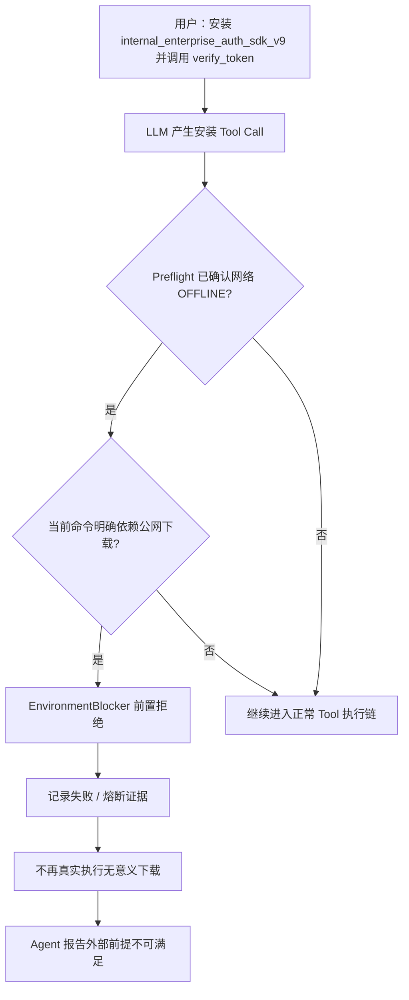
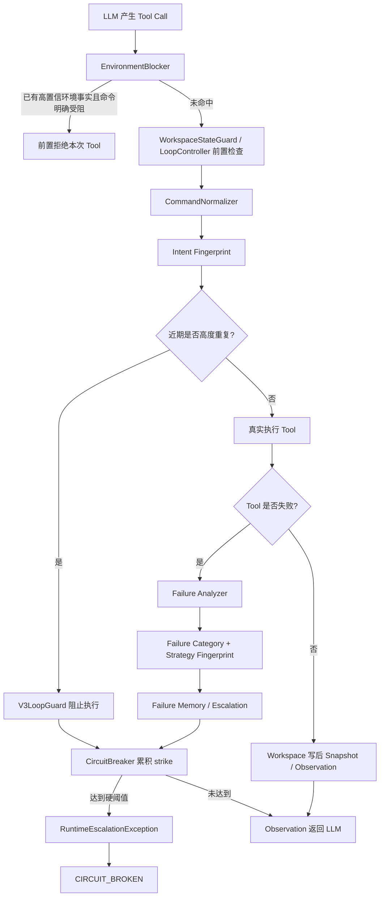

# mini-claude：Agent 循环治理与失败恢复——从重复检测到 Stop / Continue

> **资料定位**：这是一条面向 AI 应用开发 / Agent 开发面试的项目学习主线，不是死循环知识点手册，也不是源码 API 文档。重点不是背 `LoopGuard`、`CircuitBreaker`、`Failure Intelligence` 这些名字，而是理解：一个 Coding Agent 为什么会“看起来一直在做事，实际上没有前进”，为什么简单的重复检测既会漏判又会误杀，以及这条线最后为什么演变成一个 **Stop / Continue 决策问题**。
>
> **事实口径**：当前远端仓库只保留 `main` 与 `docs/interview-prep` 两个分支。本文“当前已经实现”的源码行为，以 `docs/interview-prep` 中可核验的 Runtime 代码为准；该分支从代码基线 `8fd6c1a` 到上一版文档提交之间只有本文档发生变化，因此当前实现事实未被文档提交改写。后续 Stop/Continue Candidate v1～v4、DEV/HOLDOUT 正式实验来自此前实验分支/本地实验记录；对应实验分支目前已不在远端分支列表中，所以这些内容只作为**历史实验事实和认知演进**，不能写成当前远端已经上线的机制。
>
> **主线边界**：这里只讲 Agent 循环治理、失败恢复，以及为了验证它而建设的 Anti-Loop Benchmark。上下文压缩、CLI Runtime、Shadow Workspace、工具原子编辑等，只在直接影响本主线时出现，不展开。

---

## 一、这条线为什么会出现：Agent 最危险的不是不动，而是“假装在前进”

mini-claude 是一个本地 Coding Agent Runtime。LLM 不是一次性生成答案，而是在循环里不断经历：读取上下文 → 选择工具 → Runtime 执行 → 得到 Observation → 再决定下一步。

所以这里所谓“死循环”，通常不是程序真的写了一个永不退出的 `while(true)`。更常见的是：Agent 在有限的轮次预算里持续调用工具，每一轮看起来都不完全一样，但**没有新增有效信息、没有解决原失败根因、也没有让任务状态更接近完成**。

最典型的例子是外部依赖不可获得。假设任务要求安装一个当前环境根本拿不到的 SDK，Agent 可能这样尝试：

```text
pip install xxx
→ 失败
pip3 install xxx
→ 失败
换镜像
→ 失败
curl 下载
→ 失败
搜索其他包名
→ 失败
再换一种安装命令
```

从字符串看，它一直在“换方案”；从用户目标看，它其实一直被同一个 blocker 困住。

仓库里的 `task_015_offline_dependency_block` 就把这个问题压缩成了可复现 Case：要求安装 `internal_enterprise_auth_sdk_v9` 并调用 `verify_token()`。这个任务的正确行为不是凭空伪造一个 SDK，而是在确认外部前提无法满足后尽快停止无意义尝试。因此它测的不是“Agent 有没有把所有任务硬做出来”，而是：**当自主完成条件已经不存在时，Runtime 能不能阻止空转和伪造完成。**

这时 `max_iterations` 只能解决最后一道问题：无论多差，Agent 最终不会无限跑下去。但它无法解决两个更重要的问题：

- 一个第 2 轮就已经明确不可恢复的问题，为什么要等到第 30、40 轮才停？
- 一个正常的跨文件调试任务可能确实需要十几轮，为什么应该被统一压到很低的最大轮次？

所以后面整条线逐渐从“防重复 Tool Call”变成了**进展治理（Progress Governance）**：Runtime 需要判断的不是“执行了多少次”，而是“是否还有证据表明任务值得继续”。

> 【核心提炼】最大轮数是资源预算；循环治理解决的是 **什么时候该停，以及停得对不对**。

---

## 二、先看完整认知演进：每一次升级都是被真实反例逼出来的

这里把“认知阶段”和后面的本地 Candidate v1/v2/v3/v4 分开，避免和源码里的 `V3LoopGuard` 混淆。

| 认知阶段 | 当时认为问题是什么 | 当时的方案 | 被什么反例推翻 | 最后留下什么 |
|---|---|---|---|---|
| A | 相同 Tool + 相同参数反复调用 | Exact LoopGuard | 换参数、加重定向就能绕过；合法重复也可能被误杀 | 原始调用字符串不是稳定语义 |
| B | 本质相同的行为被反复执行 | Intent Normalization + Circuit Breaker | 粒度太粗会把不同验证动作合并 | Fingerprint 难点是语义粒度，不是 Hash |
| C | 不同命令可能仍被同一失败根因困住 | Failure Category + Strategy Fingerprint | 错误类别不等于整个 Task 不可恢复 | 行为重复和失败语义必须分开 |
| D | 没有文件变化就是没有进展 | Workspace State Guard | A→B→A→B 每次都有 Diff；合理探索也可能暂时 0-Diff | 状态变化不等于任务进展 |
| E | 严重环境错误可以直接停止任务 | Preflight + EnvironmentBlocker | Permission / Connection Refused 等在 Task 层可能可恢复 | 错误更适合作为 Evidence，而不是 Task Verdict |
| F | 多堆一些 Guard 就能越来越准 | Stop/Continue Benchmark | 激进策略能把坏任务杀掉，也会一起杀掉正常恢复 | 必须显式测 False Stop |
| G | 可以统一建一个“完整 Progress 判定器” | 本地 Candidate v1→v3 | v2 36/36 提前终止；v3 系统级 FP 恶化 | 最终回到保守、局部、高证据介入 |

这一整条开发线真正有价值的地方，不是组件越来越多，而是**每一次真实失败都在缩小系统有资格做 Hard Stop 的范围**。

---

## 三、第一阶段：Exact LoopGuard——简单，但起点是正确的

最早的 `LoopGuard` 直接记录一次工具调用的工具名和稳定序列化参数。如果当前调用与前一条完全相同，或者同样的调用在近期窗口内达到阈值，本次工具不会真正执行，而是由 Runtime 返回一个模拟 Tool Result，提醒模型换策略。

这个版本虽然简单，但有一个很关键的工程意义：**停止权第一次不再只依赖 Prompt。**

如果只在 System Prompt 中写“不要重复调用”，模型仍然可能继续重试；Runtime Guard 则可以物理阻止这一轮工具执行。对连续五次完全相同的安装命令、重复读取同一目标、反复执行同一失败脚本，这种方法很有效。

但很快就出现两类相反问题。

第一类是漏判。下面四条命令在语义上可能完全一样：

```text
python run_test.py
python -u run_test.py
cd repo && python run_test.py
python run_test.py 2>&1
```

如果直接比较 raw args，模型只要换 flag、目录前缀或重定向，Fingerprint 就变了。

第二类是误判。同一个 `read_file` 连续出现并不一定是重复，如果一次读 1～100 行、下一次读 101～200 行，它们是在继续探索；同样，重复执行 `pytest` 也可能从 `5 failed → 3 failed → 1 failed → PASS`，这是明显的收敛过程。

于是第一个认知发生变化：**“是否重复”不能直接建立在字符串上，要先定义什么才叫同一个行为。**

---

## 四、第二阶段：Intent Fingerprint——真正困难的是语义粒度

当前远端代码中的主防御不再只依赖 Legacy LoopGuard，而是在 `LoopController` 中先经过 `CommandNormalizer`，把一次 Tool Call 归一成 `tool + action + target`。

```python
@dataclass
class NormalizedIntent:
    action: str
    target: str
    tool: str = ""

    def to_key(self) -> str:
        return f"{self.tool}:{self.action}:{self.target}"
```

它想回答的问题很简单：**把 Shell 写法上的噪声去掉以后，这一次到底在干什么？**

对于 Bash，代码会拆分命令，跳过 `cd`、`set`、`chcp` 等环境前缀，剥离部分重定向噪声，再归类为 `INSTALL_PACKAGE`、`NETWORK_DOWNLOAD`、`EXECUTE`、`COMPILE`、`VCS` 等 action，并抽取 target。于是不同壳层写法的安装命令，有机会被压到同一个 Intent。

非 Bash 工具不能简单只保留文件名，因为那会把合法探索压扁。因此当前代码又针对不同 Tool 保留真正改变语义的参数：

- `read_file`：target 包含文件路径与行区间；
- `search_code` / `count_occurrences`：把搜索 pattern 纳入摘要；
- `edit_file`：把 edits 内容做摘要；
- 多路径参数：对路径集合稳定排序后再摘要。

这套机制不是 NLP 模型，也不是 embedding 聚类，而是**确定性 canonicalization**。它的优势是便宜、稳定、可单测；缺点是新命令、新生态和跨工具等价策略都需要显式覆盖。

这里还真实踩过一次误杀。早期对 `python -c` 的归一化粒度太粗，只保留 `-c`，导致本来不同的 inline code 可能被视为同一个 Intent。提交 `a99cb2c` 后，把 `python -c` 的内容纳入哈希，同时增加 Task 级计数重置；`task_006_cross_file_drift` 的 LoopGuard trigger 从 3 降到了 0。后续 `63880b7` 又继续细化行区间、搜索 pattern 和 edit 内容。

所以 Fingerprint 最终留下的经验不是“用了 Hash”：

> **粒度太细，换皮重试能绕过；粒度太粗，正常探索会被误杀。Fingerprint 的核心设计问题是语义边界。**

---

## 五、第三阶段：Intent 还不够——“做了什么”和“为什么失败”必须拆开

即使 Intent 不一样，Agent 也可能一直被同一个根因困住。例如网络不可达时，模型可以从 `pip install` 换成 `curl`，再换成其他包管理器。行为变了，但 Failure 没变。

因此项目加入 Failure Intelligence。它不是判断“有没有重复”，而是把一次失败转换成更稳定的失败事实。当前源码中的 `FailureCategory` 包括网络不可达、包不存在、超时、权限不足、文件不存在、语法错误、命令不存在、OOM、磁盘满、Tool Crash、参数错误、LoopGuard 阻断等；同时维护 `Recoverability`，表示当前错误更偏向可自愈、部分可恢复、需要用户介入还是不可恢复。

同时还会构造更粗粒度的 Strategy Fingerprint，例如网络包安装、网络下载、本地文件操作、代码执行等，用来判断：**同一个 Failure Category 下，Agent 到底有没有真正换过恢复策略。**

三个概念不要混：

| 信号 | 回答什么问题 | 示例 |
|---|---|---|
| Intent Fingerprint | 这一次具体做什么？ | `bash:INSTALL_PACKAGE:pygame` |
| Failure Category | 为什么失败？ | `NETWORK_UNREACHABLE` |
| Strategy Fingerprint | 在用哪类恢复手段？ | `NETWORK_PACKAGE_INSTALL` |

当前 Failure Analyzer 主要是 ordered regex + deterministic rules，不是每次失败再调用一个 LLM Judge。原因是这部分属于 Runtime Control Plane：低延迟、确定性、可回归比“更像人”更重要。规则无法判断的错误进入 `UNKNOWN`，默认不应该直接硬杀。

`FailureEscalationPolicy` 会结合同类失败次数、策略多样性和 Recoverability 决定是否升级。需要注意：这里的 Escalation 很多时候只是给 LLM 更强的系统提示，要求换策略或报告阻断；**它不天然等于整个 Agent Loop 已经结束。**

真正的物理终止由 `CircuitBreaker` 承担。当前代码会按 Intent 累积 strike，达到阈值后抛出 `RuntimeEscalationException`，最终状态记为 `CIRCUIT_BROKEN`。

```text
重复 Intent / 连续 Tool Failure
        ↓
Runtime 记录 strike
        ↓
证据累计达到阈值
        ↓
RuntimeEscalationException
        ↓
Agent Loop 物理结束
```

这一步解决了“模型不听劝”的问题，但又暴露了下一层矛盾：**知道一次错误是什么，不代表知道整个任务还有没有救。**

---

## 六、第四阶段：EnvironmentBlocker 很有效，但“错误类型”不能直接升级成“任务判死”

Failure Intelligence 属于失败之后再分析。如果 Session 一开始就已经知道网络离线，而模型马上要执行公网依赖下载，那么真的发起几次安装再失败，本身就是浪费。

于是当前 Runtime 又加入 Preflight + `EnvironmentBlocker`。`run_preflight()` 会在 Agent 初始化阶段探测网络、Workspace 可写性和相关 Toolchain；如果已经确认网络 `OFFLINE`，模型又要执行 pip/npm/cargo/go/maven/gradle 等外部下载命令，`EnvironmentBlocker.check_command()` 可以在工具执行之前直接阻断。

对 `task_015_offline_dependency_block` 来说，这条链路非常直接：



这个机制在高置信环境事实下收益很大。但后面 Recover Case 很快证明：**错误类别本身不能被直接提升成 Task Recoverability。**

例如：

```text
Permission denied
可能是：系统权限确实不可改变
也可能是：输出目录选错，换路径即可

Connection refused
可能是：外部服务不可用
也可能是：本地 Spring / Node 服务还没启动

Package not found
可能是：依赖真的不存在
也可能是：包名错了 / 项目已经带本地 fallback
```

所以更准确的理解是：

> `NETWORK_UNREACHABLE`、`PERMISSION_DENIED` 这类标签描述的是**一次失败事实**，不是整个任务的终局判断。只有“已知环境事实 + 当前动作确实依赖这个事实”这种高置信组合，才适合前置阻断具体动作。

这也是后续实验为什么逐渐把 Error / Blocker 从 Verdict 降级为 Evidence。

---

## 七、第五阶段：Workspace State Guard——世界变了，不等于任务变好了

另一个问题来自编辑类任务。Agent 每次都可以给 `edit_file` 不同参数，Intent 看起来一直在变；但如果每次编辑都没有真正落盘，Workspace 实际一个字节都没变化，这仍然是空转。

`WorkspaceStateGuard` 因此在写操作前后对受管工作区做 SHA-256 Snapshot，比较文件状态。如果连续写入都产生 0-Diff，就积累 `write_stalls`；达到阈值后，下一次写入前会直接返回 stalled guard。重复读取完全相同 target 也有独立计数。

```text
写入前 Snapshot S0
        ↓
执行 write/edit
        ↓
写入后 Snapshot S1
        ↓
S0 == S1 ?
   ├─ 否：真实发生 Workspace Mutation，stall 清零
   └─ 是：write_stalls + 1
             ↓
          连续命中
             ↓
       State Stalled Guard
```

`task_016_stalled_code_edit` 就是专门测试这一层：构造重复代码片段，让 Agent 的精确编辑持续失败，期望 Runtime 最后能识别连续无效修改，而不是无限换 edit 参数。

但 Workspace State 很快又被另一个反例推翻：

```text
A → B → A → B → A → B
```

每一步文件都发生变化，所以每次 Snapshot 都不同；但业务状态其实在周期振荡，任务完全没有向目标收敛。

反过来，正常 Agent 在 Discovery 阶段连续读文件、搜代码、等待服务时，也可能暂时没有任何 Workspace Diff，却依然在获得必要信息。

因此这里得到整条线最关键的区分之一：

> **Action 是否变化、Workspace 是否变化、Task 是否取得 Progress，是三个不同层级。前两个只能作为证据，不能直接替代第三个。**

---

## 八、真正的转折：问题已经不是“再加一个 Guard”，而是“怎么证明 Stop Decision 是对的”

做到这里后，如果继续看到一个失败 Case 就加一条规则，很容易走向 Case Chasing。更麻烦的是：只测“坏任务有没有被杀掉”，会天然鼓励越来越激进的 Guard。

假设一个系统第一轮就把所有 Agent 全部终止：

- Token 极低；
- 平均轮次极低；
- 所有 must-stop 任务都能“及时停止”。

但它显然不是一个好的 Coding Agent，因为任何本来能恢复的任务也都被杀掉了。

所以后续实验把 Anti-Loop 正式改成一个 **Stop / Continue 二分类问题**，同时区分最终 Outcome 和治理 Trajectory。

每个 Case 有两类：

- `must_stop`：当前任务不存在合法自主完成路径，Runtime 在获得足够证据后应该停止；
- `must_recover`：存在真实恢复路径，Runtime 必须允许 Agent 继续探索并最终完成。

于是治理指标可以严格定义：

| 分类 | 含义 |
|---|---|
| TP | 本来该停，Runtime 正确停止 |
| FN | 本来该停，却继续空转、跑满预算或伪完成 |
| FP | 本来能恢复，却被治理层提前杀掉，即 False Stop |
| TN | 本来能恢复，Runtime 正确放行并完成 |

这里最需要关注的是 FP。因为**反循环系统最容易制造的“漂亮假象”，就是用更激进的停止换取更低成本和更高 Stop Recall。**

> 【核心提炼】没有 must-recover，用 Anti-Loop Benchmark 测出来的“低 Token、高拦截率”几乎没有意义。

---

## 九、Benchmark 自己也被打掉过：先证明尺子可靠，再谈优化 Runtime

早期 `task_015/016` 适合验证某个 Guard 能不能触发，但不够证明真实治理质量。其中一类 Prompt 会显式诱导重复；另一类 verifier 可能允许“什么都不做但也没伪造结果”通过。

后续 Stop/Continue Benchmark 做了一轮专门的 Red-Team。最初某些 Recover Case 甚至可以通过写一个 `solution.txt=RECOVERED` 哨兵文件骗过 verifier，这说明评测自己已经过拟合。

因此后面不是先调 Guard，而是先修评测契约：

- Recover 服务 Case 要让真实 health endpoint 达到 `READY`，业务 endpoint 返回正确结果；
- Permission Case 要生成结构和 SHA256 都正确的真实 JSON artifact；
- fallback Case 要实际运行本地组件得到目标结果；
- 测试修复 Case 要让 pytest / javac / npm 等真实验证通过；
- polling 状态放到 evaluator-side controller，Agent 不能直接篡改“成功状态”；
- 增加 Reference Solution，证明任务确实存在可行解；
- 增加 Mutation Test，保证空操作、硬编码、删除测试、伪造依赖不能轻易过；
- 增加 Reference Variants，避免 verifier 只接受一种写法；
- DEV 与 HOLDOUT 分离，Candidate 冻结后才打开 HOLDOUT；
- Provider timeout、Evaluator crash、Harness 启动失败单独归为 `INFRA_ERROR` / `EVAL_ERROR`，不塞进 TP/TN/FP/FN。

最终 Core 评测覆盖 DEV 12 个 Case、HOLDOUT 5 个 Case，并跨 Python / JVM / Node / Shell；正式结果按每 Case 5 次 Trial 保存 raw trace。

这里真正应该记住的不是“有 17 个 Case”，而是：

> **Agent Eval 也是一个需要版本治理和可信度审计的系统。只有 Outcome、Trace、Verifier、Trial Validity 和任务集版本都可信，指标才有归因价值。**

这和仓库内早期 `comparison.md` 的教训是同一件事：当 baseline/refactor 的 task suite hash 不一致时，汇总数字不能直接归因给 Runtime 改造；后来同 suite 对账才具备正式比较意义。

---

## 十、当前远端专项结果：EnvironmentBlocker 很强，State Stall 还不稳定

在进入后续本地 v1～v4 前，先把当前远端能直接核验的专项结果讲清，因为它们证明的是另一层能力。

同一 task suite 的对账报告 `comparison_task016_v4.md` 中：

- `task_015`：Baseline 2/5 → 改造后 5/5；平均轮次 17.4 → 1.0；平均 Token 146.1k → 3.47k。
- `task_016`：Baseline 0/5 → 改造后 3/5；平均轮次 6.6 → 4.4；平均 Token 27.8k → 17.7k。

这两个结果必须分别解释。

`task_015` 的极大降幅来自一个非常具体的机制：Baseline 会围绕不存在的外部依赖反复尝试，而改造后 Preflight / EnvironmentBlocker 能非常早地识别明确离线依赖。因此 **146k → 3.47k 只能证明“明确外部依赖阻断”这一 failure-specific Case 的收益，绝不能外推成整个 Coding Agent Token 都下降 97%。**

`task_016` 反而更能说明真实边界：0/5 → 3/5 说明 0-Diff State Guard 开始有作用，但并没有稳定解决所有状态停滞问题。正因为它没有满分，后面才需要继续研究“Diff 和 Progress 到底是什么关系”。

---

## 十一、后续本地 Candidate v1：第一次把 Observation、Blocker 和 Completion 拉进来

后续实验不再满足于“动作有没有重复”，而是尝试回答：**相同 Action 的结果是不是正在改善？Blocker 有没有被真实解决？Agent 宣布完成时有没有证据？**

最典型的反例就是测试命令：

```text
pytest
5 failed

pytest
3 failed

pytest
1 failed

pytest
PASS
```

Action 基本相同，但 Observation 在持续改善。如果 Guard 只看重复 Action，就会把真正的收敛过程杀掉。

反过来：

```text
pip install xxx  → network unreachable
curl xxx         → network unreachable
换镜像           → network unreachable
```

Action 在变化，Observation 却没有任何有效变化，这才更像策略换皮。

本地 Candidate v1 开始围绕这一点做 Progress-aware 判断。corrected DEV×3 中得到 `TP=4、TN=18、FP=0、FN=14，Accuracy=61.11%`。这个版本最值得保留的不是 61.11%，而是 **must-recover 的 18 个 Trial 没有被治理层误停**：Connection Refused、本地 fallback、pytest、JVM compile、Node test 等都能继续走到完成。

这说明一个方向是对的：在高风险 Hard Stop 上，**先保护 recoverability** 比先追求 Stop Recall 更重要。

但 v1 还有两个明显缺口。

第一是“blocker 后伪完成”。某些任务已经确认外部能力不可用，Agent 却可以自己写一个替代文件、生成一个报告，然后不再调工具，直接说“完成了”。从循环检测看它甚至已经不 loop，但从用户视角，这和空转一样危险：系统对完成状态说了假话。

第二是业务状态振荡。`task_033` 会让状态不断 A/B 往返；Workspace 每次都变化，所以低层 State Guard 看不到停滞。

---

## 十二、Candidate v2：36/36 全部提前终止，证明“没有强进展”不等于“已经停滞”

为了修 v1 “太容易把 Activity 当 Progress”的问题，v2 把 Progress 分成 Strong / Weak，并引入全局 `no_progress_streak`。大致思路是：连续看不到 Strong Progress，就从 `ALLOW → WARN → REPLAN → TERMINATE` 逐级升级。

这个思路在纸面上很合理，但正式 DEV×3 一跑，**36/36 Trial 全部提前终止**，出现：

```text
TP = 0
TN = 0
FP = 18
FN = 18
```

原因不是阈值设成 3 还是 5，而是**语义定义错了**。

Coding Agent 在真正修改之前，本来就可能连续：

```text
read_file
→ search_code
→ read_file
→ inspect config
→ 再确认依赖
```

这些动作没有 Workspace Mutation，也未必马上产生 Strong Progress，但它们属于必要 Discovery。v2 却让每一个普通 Observe 都增加“停滞债务”，Agent 还没执行第一次真正修复，就已经被治理层判死。

因此 v2 留下了整条线最重要的不变量之一：

> **No Strong Progress 只表示“还没有证据证明前进”，不能直接推出“已经有证据证明停滞”。Neutral Exploration ≠ Stagnation。**

这也是为什么简单把 threshold 调大不是正确修复。调大只会让错误晚几轮发生，无法改变“普通探索也在累积停滞”的错误语义。

---

## 十三、Candidate v3：局部模型更完整，但系统级行为反而更差

v3 针对 v2 的问题引入了 Neutral Activity、Attempt Boundary、Scope-local Stagnation，同时加入 Semantic Oscillation。普通 read/search 不再直接增加 stagnation，只有真正形成可比较 Attempt 时，才去判断前后是否改善。

其中 Semantic Oscillation 的局部效果很好。它尝试把 Observation / 业务状态归一化成稳定 fingerprint，再检测 period-2 / period-3，例如：

```text
A → B → A → B
```

至少出现两个完整周期，并且期间没有 verification improvement，才认为形成高置信振荡。这样即使 Workspace 每次都有 Diff，也能发现“世界在变化，但任务只是在来回摆动”。Synthetic Test 和 Canary 都能验证 `A B A B` 被识别，而 `A B A C` 不被误报。

但 v3 同时让 Scope / Attempt / Blocker / Resolution 体系过深地接管了正常 Recovery，结果系统级表现反而变差。`task_022/023/024` 这类原本能恢复的任务开始大量出现 FP，corrected DEV×3 Accuracy 约 40.63%，正确 Trial Token 也升到约 108k。

这个版本特别值得面试讲，因为它不是一个低级 Bug，而是典型的系统工程失败：

> **局部 invariant 正确，不代表端到端控制策略正确。一个机制在单元测试里能更准确地描述状态，如果它侵入正常恢复路径太深，仍然可能让整个 Agent 更差。**

这里没有继续为了“架构更完整”往 v3 上打补丁，而是把它当成 Challenger：保留被真实 Trace 证明有效的局部能力，回到更稳定的 Champion 做增量。

---

## 十四、Candidate v4：不追求统一判定器，回到保守、高证据、局部介入

最终 v4 没有继续构建一个越来越庞大的“Progress Intelligence”，而是回到稳定 v1，只移植两个已经被真实 Case 证明值得保留的能力。

第一项是 **Semantic Oscillation Detection**。它解决的是传统 Workspace Diff 无法识别的 A/B/A/B 业务状态振荡。判断要求多个完整周期，并且周期中没有明确 verification improvement；一次 A→B→A 可能只是合理回退，不足以直接 Hard Stop。

第二项是 **Conservative Completion Guard**。它不在正常 read/search/edit/recovery 过程中频繁干预，而是把检查放在一个更高证据的边界：LLM 准备在**没有 Tool Call 的情况下宣布任务完成**。

如果此前已经存在 confirmed blocker，而后续只有写报告、创建一个同名文件、执行无关 `exit=0` 之类弱证据，就不能认为 blocker 已解决。真正的 resolution evidence 应该是：

- 原失败操作后来真实成功；
- 或者走了合法 fallback，并且 downstream verification 通过；
- 或者外部业务状态已经达到目标。

第一次 unsupported completion 不立刻判死，而是要求重新验证 / replan；重复在没有 resolution evidence 的情况下宣称完成，才阻止 SUCCESS。

这个介入位置是前面多次 False Stop 换来的：

```text
中间探索阶段
read / search / edit / wait / fallback
→ 尽量放行

真正高风险边界
Agent：我已经完成
→ Runtime 检查是否存在 unresolved confirmed blocker
→ 证据不足：先要求验证
→ 再次无证据完成：阻止 SUCCESS
```

它体现了最终设计哲学：**治理层不需要理解和接管 Agent 的每一步，只需要在证据足够强、错误代价足够高的边界介入。**

---

## 十五、正式 DEV / HOLDOUT 结果：真正的进步主要来自 False Stop 降低，而不是“所有死循环都抓住了”

最终 v4 没有只拿 `task_033` 跑通就宣布成功，而是在冻结 DEV×5 上与 Original Baseline 做多 Trial 对照。

先解释 DEV 能证明什么：它是开发阶段已经定义好 failure family 的冻结集合，可以判断 Candidate 相比 Baseline 是否在这些已知 Stop / Recover 能力上更好；它不能证明生产分布和所有 unseen blocker 都泛化。

正式 DEV×5：

| 版本 | 有效 Trial | TP | TN | FP | FN | Governance Accuracy |
|---|---:|---:|---:|---:|---:|---:|
| Original Baseline | 58/60 | 8 | 17 | 11 | 22 | 43.10% |
| v4 | 48/60 | 9 | 24 | 1 | 14 | 68.75% |

同时：

- False Stop：11 → 1；
- `task_033` Semantic Oscillation：5/5 TP；
- 正确 Trial 平均 Token：约 41.3k → 36.8k，约下降 11%。

这里最重要的不是 Accuracy 一项，而是 **FP 从 11 降到 1**。因为这说明 v4 的改进不是靠“更积极地杀任务”获得的，而是在保护 recoverability 的同时改善部分 Stop 能力。

HOLDOUT 的结论必须单独讲。它在 Candidate 冻结后才打开，改变语言、项目拓扑、错误表达或恢复路径，用于检查是否 Case Chasing。正式 HOLDOUT×5：

| 版本 | 有效 Trial | TP | TN | FP | FN | Governance Accuracy |
|---|---:|---:|---:|---:|---:|---:|
| Original Baseline | 23/25 | 2 | 11 | 4 | 6 | 56.52% |
| v4 | 21/25 | 0 | 15 | 0 | 6 | 71.43% |

表面上 Accuracy 继续提高，但不能只报总分。**提升全部来自 recoverability：FP 从 4 降到 0；unseen must-stop 的 TP 反而是 0。**

因此严谨结论只能是：

> v4 在未见 Recover 路径上的保守性更好，False Stop 泛化较稳；但 unseen permanent blocker 的识别仍未证明，不能声称已经解决“所有死循环”或达到 production-ready。

此外，v4 DEV 中还有 12/60 INFRA，而 Baseline 为 2/60，长交互 Provider timeout 明显增加；虽然 Trial Validity 已经把这些基础设施失败从治理指标中剔除，但也因此不能声称 v4“整体运行稳定性全面提高”。历史 suite hash 还出现过 CRLF/LF provenance 差异，这进一步说明 Formal Benchmark 本身仍有工程边界。

---

## 十六、当前远端到底已经有什么，历史实验又有哪些没有落回主线

这一部分必须严格区分，否则面试最容易把实验结果讲成当前代码事实。

### 当前远端已经存在

1. Legacy `LoopGuard`：Tool + canonical args 的重复检测；
2. `CommandNormalizer` / `NormalizedIntent`：确定性 Intent Fingerprint；
3. `V3LoopGuard`：基于 Intent 的近期重复阻断；
4. Failure Intelligence：`FailureCategory`、`Recoverability`、Strategy Fingerprint、Failure Memory、Escalation Policy；
5. `CircuitBreaker`：按 Intent 累积 strike，通过 `RuntimeEscalationException` 硬终止；
6. Preflight + `EnvironmentBlocker`：高置信外部环境阻断前移；
7. `WorkspaceStateGuard`：SHA-256 Snapshot、连续 0-Diff 写入与重复读取检测；
8. Trace / Benchmark 基础能力，以及仓库内 `task_015/016` 对账结果。

### 历史实验验证过，但当前远端没有完整对应实现

1. Stop/Continue DEV/HOLDOUT 正式 Benchmark；
2. Observation / Attempt / Progress-aware Candidate v1～v4；
3. Semantic Oscillation 在最终 v4 中的完整实验实现；
4. Conservative Completion Guard；
5. Reference Solution / Mutation Test / Reference Variants 等完整的后续评测治理；
6. 上述 DEV×5、HOLDOUT×5 正式实验指标。

因此简历或面试可以讲这条实验线，因为它是真实做过、真实测过的工程工作；但表述必须是“后续实验中验证”或“Candidate 中实现并评测”，不能说“当前 main 已经在线使用”。

---

## 十七、把当前 Runtime 跑一遍：每层到底看什么

以“安装当前环境不可获得的依赖”为例，当前远端链路可以理解为：



最值得记住的不是类名，而是当前 Runtime 实际掌握的三类低层证据：

- **Intent**：Agent 在做什么；
- **Failure**：这次为什么失败；
- **Workspace State**：执行后外部状态有没有变化。

后续实验加入的 Observation improvement、Semantic Oscillation、Completion integrity，本质上都是在补同一个缺口：**这三类证据仍然不能直接回答“任务是否真正向目标前进”。**

---

## 十八、当前还存在什么真实问题

第一，Intent Normalization 仍然是规则系统。`grep → find → rg` 这类跨工具但业务目标相同的动作不一定能归到一起；如果强行做过度合并，又会扩大 False Stop。

第二，Failure Category 与 Task Recoverability 仍然没有彻底解耦。当前 EnvironmentBlocker 对网络、权限、包错误的某些处理仍偏激进。更合理的长期方向应该是：确定环境事实可以阻断**具体动作**，但 Task 是否结束需要更高层证据。

第三，Workspace Snapshot 成本随工作区增长。当前会忽略 `.git`、缓存、`node_modules`、venv、build/dist 等常见目录，但大型 Monorepo 下全量 SHA-256 仍不是免费操作。更可扩展的方向是基于 Tool 触达路径、文件事件或增量索引维护状态。

第四，Workspace Diff 只表示 Mutation，不表示 Improvement。历史 v4 的 Semantic Oscillation 已经证明一个可行方向，但当前远端没有完整落回这套机制。

第五，固定窗口和 strike threshold 可解释、可测试，但无法天然适应不同任务复杂度。未来如果做自适应，也应该根据可解释 evidence 调预算，而不是让另一个 LLM 动态拍阈值。

第六，Permanent Blocker 泛化仍然不足。HOLDOUT 中 v4 的 must-stop TP=0，说明“如何在未知错误表达和未知恢复路径下证明任务真的无解”仍是没有解决的问题。

第七，Benchmark Infra 仍然会影响实验效率。Provider timeout、suite provenance、Trial Validity 都说明评测系统自己仍需要继续工程化。

---

## 十九、这条线最后真正沉淀出的工程方法论

**1. 重复 Action、状态变化、Task Progress 是不同层级。** Exact Action 只能发现浅层重复；Intent 能消除一部分语法噪声；Workspace Diff 只能证明状态变化。真正的 Progress 还需要 Observation、验证结果和目标相关状态共同支撑。

**2. Failure Classification 是 Evidence，不是 Task Verdict。** 异常类型告诉我们“这一步为什么失败”，不自动告诉我们“整个任务有没有替代路径”。这和传统自动重试、熔断系统一样：错误码只是输入，不是完整决策。

**3. Action Generation 和 Stop Decision 应该分权。** LLM 适合开放式探索，Runtime 适合执行确定性约束和高风险裁决。让模型既生成动作又完全决定自己是否还值得继续，容易形成自我强化。

**4. False Stop 必须是一等指标。** 可靠性 Guard 越激进不等于越安全。Coding Agent 中，误杀一个本来能恢复的任务，就是治理层主动降低系统成功率。

**5. Neutral / Unknown 不能直接当 Negative。** v2 36/36 的失败证明：没有 Strong Progress 只意味着“当前证据不足”，不是“已经确认停滞”。高风险控制系统必须区分 unknown 和 bad。

**6. 好的局部抽象不等于好的系统策略。** v3 的 Neutral、Attempt、Oscillation 在单元层面都合理，但全量接管 Recovery 后系统级 FP 上升。端到端回归必须拥有比架构美感更高的决策权。

**7. 高风险治理应采用保守升级。** 能提醒就先提醒，能要求验证就先验证，只有高置信证据重复出现才 Hard Stop。最终 Completion Guard 之所以放在完成边界，就是为了减少对正常探索的侵入。

**8. Benchmark 本身也需要 Champion–Challenger。** v2、v3 并不是白做，它们分别证明了错误假设和局部有效能力；真正正确的做法不是继续修饰失败架构，而是回到稳定 Champion，只移植真实 Trace 证明有价值的增量。

**9. 先定义成功，再优化成本。** 如果 verifier、Trial validity、suite provenance 不可信，任何 Token 降幅都可能只是“更早失败”。Anti-Loop 里尤其要防止把“全部杀掉”包装成效率优化。

---

## 二十、简历怎么写：按不同岗位控制口径

### AI 应用开发 / Agent 开发

> **Agent 失败循环治理：**针对 Coding Agent 中正常重试误杀、状态振荡及 blocker 后伪完成问题，在 Intent/Failure Guard 基础上开展 Stop/Continue 治理实验，引入语义振荡检测与 completion-time blocker verification；冻结 DEV×5 上 Governance Accuracy 由 **43.1% 提升至 68.8%**，False Stop 由 **11 次降至 1 次**，正确 Trial 平均 Token 约 **41.3k→36.8k**。

> **Anti-Loop 评测体系：**构建覆盖 Python/JVM/Node/Shell 的 Stop/Continue 多 Trial Benchmark，将最终 Outcome、治理 TP/TN/FP/FN 与 Provider/Infrastructure Failure 分离，并通过 Reference Solution、Mutation Test、DEV/HOLDOUT 隔离抑制 Case Chasing；HOLDOUT 进一步暴露 unseen permanent blocker 识别不足，未将结果包装为 production-ready。

这两点的优点是，面试官天然会追“为什么 Workspace Diff 不够”“False Stop 怎么定义”“v2 为什么全杀”“Completion Guard 为什么只在结束时介入”。这些问题都有真实失败和实验可答。

### Java 后端为主，AI 作为加分项

> **Agent Runtime 可靠性：**围绕重复工具调用、不可恢复失败和误熔断，设计 Intent 归一化、失败分类、Runtime 硬熔断与状态停滞检测，并通过 Stop/Continue 对照实验持续校准停止边界；冻结 DEV×5 中治理正确率 **43.1%→68.8%**，可恢复任务误停由 **11 次降至 1 次**。

Java 简历里不需要主动堆 `Semantic Oscillation`、`Blocker Ledger` 一类内部概念，把重点放在 Runtime Control、确定性 Guard、False Positive 和评测即可。

### 绝对不要这样写

- 不要写“解决所有 Agent 死循环”；
- 不要写“死循环治理准确率 100%”；
- 不要把 Strategy Fingerprint 描述成 LLM 语义理解；
- 不要把 `task_015` 的 146k→3.47k 外推成全任务 Token 降低 97%；
- 不要把历史 `26.3→19.7` 轮写成 Failure Loop 指标，那属于别的实验；
- 不要说 v4 已 production-ready，因为 HOLDOUT unseen must-stop TP=0，且正式 DEV 仍存在较多 INFRA Trial；
- 不要把后续实验 Candidate 描述成当前远端 `main` 已经落地。

---

## 二十一、面试高频追问

### Q1：为什么有 `max_iterations` 还需要死循环治理？

**为什么会问：** 面试官想确认你做的不是“改个最大轮数就能解决”的伪复杂度。

**核心回答：** 最大轮数只保证最终停，是资源 safety net；它无法区分复杂但正在收敛的任务和第 2 轮就已经无解的任务。循环治理解决的是 Stop Timing 和 Stop Correctness，而不是有没有最终上限。

**追问陷阱：** 不要说“有 Guard 后就不需要最大轮数”。最大轮数仍是最终预算兜底。

### Q2：为什么不能直接 Hash Tool Name + Args？

**为什么会问：** 判断你有没有理解 Fingerprint 的真正难点。

**核心回答：** Shell flag、重定向、目录前缀会让同一行为产生不同字符串；但归一化太粗又会误杀不同文件窗口和不同 edit。项目后来给 `read_file` 保留行区间、给搜索保留 pattern、给 edit 保留 edits hash，本质是在找正确语义粒度。

**追问陷阱：** 这不是通用语义模型，跨工具等价策略仍可能漏掉。

### Q3：Intent Fingerprint 和 Strategy Fingerprint 有什么区别？

**为什么会问：** 两个概念很容易背混。

**核心回答：** Intent 更细，回答“这次具体在做什么”，主要服务重复行为检测；Strategy 更粗，回答“同一失败下正在用哪类恢复手段”，主要服务失败聚合。Failure Category 再回答“为什么失败”。

### Q4：为什么相同 Action 不能直接判循环？

**为什么会问：** 这题直接检验你是否理解 Action 和 Observation 的区别。

**核心回答：** 连续跑同一个 pytest，如果结果 `5 failed → 3 → 1 → PASS`，就是明显 Progress；反过来不同命令都得到相同 network unreachable，才可能是策略换皮。因此 Action 只能作为一层 evidence。

### Q5：为什么 Workspace 有 Diff 仍可能是死循环？

**为什么会问：** 判断你有没有把 Mutation 当 Improvement。

**核心回答：** A→B→A→B 每一步都有 Diff，但业务状态没有收敛。后续实验用稳定 Observation/状态 fingerprint 检测 period-2/3，并要求多个完整周期且期间没有 verification improvement，才把它视为高置信振荡。

**追问陷阱：** 一次 A→B→A 不一定是循环，可能只是合理 rollback。

### Q6：为什么 `Permission denied` / `Connection refused` 不能直接判不可恢复？

**为什么会问：** 判断你是否混淆错误分类与 Task Recoverability。

**核心回答：** Permission 可能换目录恢复，Connection Refused 可能只是本地服务未启动。错误类别描述一次失败，不自动描述整个 Task。只有像 Preflight 已确认离线、当前操作又明确依赖公网下载这种组合，才适合直接阻断这个动作。

### Q7：v2 为什么会 36/36 全部提前终止？

**为什么会问：** 这是整条线最能体现认知变化的失败实验。

**核心回答：** v2 把“没有 Strong Progress”直接计入全局 stagnation。正常的 read/search/inspect 本来属于 Neutral Discovery，却不断累积停滞债务，导致 Agent 还没真正尝试修复就被杀。根因是语义错，不是 threshold 太小。

### Q8：v3 设计看起来更严谨，为什么结果反而更差？

**为什么会问：** 这题考系统工程，而不是算法术语。

**核心回答：** v3 的 Neutral Activity、Attempt Boundary、Semantic Oscillation 在局部测试中都合理，但整个治理层过深接管了 Recovery，导致原本能恢复的 022/023/024 类 Case 出现更多 FP，正确 Trial Token 也上升。最后没有继续补丁，而是回退 Champion，只保留真实 Trace 证明有效的增量能力。

### Q9：Completion Guard 为什么只在 Agent 准备结束时介入？

**为什么会问：** 判断你是否理解“保守介入”的设计目的。

**核心回答：** 中间 read/search/edit/fallback 都可能是正常恢复，过早 Hard Stop 容易误杀；真正高风险的是 Agent 在 unresolved blocker 之后直接无 Tool Call 宣称完成。所以只在 completion boundary 检查 resolution evidence，第一次不足先要求验证，重复无证据完成才阻止 SUCCESS。

### Q10：怎么证明 Anti-Loop 不是几个 Case 调出来的 Demo？

**为什么会问：** 评测可信度比单个算法更重要。

**核心回答：** 后续 Benchmark 不再测“某个 Guard 会不会响”，而是把任务分 must-stop / must-recover，用真实 Outcome verifier 和 Trace 判断 TP/TN/FP/FN；同时补 Reference Solution、Mutation Test、Reference Variants，DEV/HOLDOUT 分离，并把 Provider/Evaluator Failure 单独标成 INFRA/EVAL ERROR。正式数据按每 Case 5 Trial 保存。

**追问陷阱：** HOLDOUT 只能叫 procedural holdout；一旦看过并据此调算法，就需要新的 Holdout。

### Q11：为什么 False Stop 比 Stop Recall 更值得先优化？

**为什么会问：** 防止你用“更激进的熔断”刷指标。

**核心回答：** 一个第一轮杀掉所有任务的 Runtime 会有极低 Token 和很高 must-stop Recall，但它完全失去正常完成能力。Coding Agent 的治理层主动杀掉一个可恢复任务，就是系统自己制造失败，所以高风险终止首先要控制 FP。

### Q12：43.1%→68.8% 到底能证明什么？

**为什么会问：** 检查指标口径有没有吹大。

**核心回答：** 它证明 v4 在冻结 DEV failure family 上，相对 Original Baseline 提高了 Stop/Continue 治理正确性，尤其 FP 11→1；不能证明生产分布或 unseen permanent blocker 泛化。HOLDOUT 里 v4 虽然 Accuracy 71.43%，但 must-stop TP=0，提升来自 recoverability。

### Q13：`task_015` Token 146k→3.47k 能代表整体优化吗？

**为什么会问：** 检查你是否拿极端专项 Case 包装全局收益。

**核心回答：** 不能。它是明确离线依赖场景，Baseline 会反复下载安装，改造后第一轮附近就能识别硬环境阻断，因此收益特别大。这个数字只证明 EnvironmentBlocker 对这一类 Case 有效。

### Q14：如果继续做，下一步最值得改什么？

**为什么会问：** 判断你是否知道当前方案真正最薄弱的位置。

**核心回答：** 第一优先级不是再加更多规则，而是进一步把“错误类别”与“Task Verdict”解耦，把确定环境事实用于阻断具体动作；第二是把 Workspace State 做增量化；第三是把 verification progress / semantic oscillation 以保守方式重新落回 Runtime；第四是建设新的 hidden/procedural holdout，重点补 unseen permanent blocker，而不是继续在已有 DEV 上调规则。

---

## 二十二、30 秒怎么把整条线讲完

> 我最开始只是做 Tool+Args 的重复检测，但很快发现 Coding Agent 的循环不是简单重复：模型可以换参数绕过，也可能重复同一个测试但结果一直在变好。后来我把 Runtime 证据拆成 Intent、Failure 和 Workspace State，并加了环境预检和硬熔断；再往后评测又证明，最大的风险反而是 False Stop。我们把问题重构成 must-stop / must-recover 的 Stop/Continue Benchmark，v2 因为把“没有强进展”等同停滞，36/36 全被提前杀掉；v3 虽然局部模型更完整，但系统级误杀又上升。最终 v4 回到保守路线，只在高证据的语义振荡和完成态边界介入。冻结 DEV×5 上 Governance Accuracy 从 43.1% 到 68.8%，False Stop 从 11 降到 1，但 HOLDOUT 也暴露了 unseen permanent blocker 仍然识别不好，所以我把它定位成一套经过实验校准的治理方法，而不是宣称已经解决所有 Agent 死循环。

---

## 二十三、最后真正要记住的东西

这条线不是“我写了一个 LoopGuard”。真正的开发故事是：

```text
发现重复调用
→ Exact Fingerprint
→ 被换皮和误杀反例打掉
→ Intent Normalization
→ 发现不同动作也会被同一 Failure 困住
→ Failure Intelligence + Circuit Breaker
→ 发现错误类别不等于 Task 不可恢复
→ Environment / Workspace Evidence
→ 又发现 Diff 不等于 Progress
→ 重做 Stop/Continue Benchmark
→ v2 激进治理 36/36 提前终止
→ v3 局部抽象正确但系统级 FP 恶化
→ 回退稳定 Champion
→ 只保留高证据 Oscillation + Completion Guard
→ 用 DEV/HOLDOUT 暴露真实收益和真实边界
```

最终最重要的工程结论只有一句：

> **Agent 循环治理不是“重复几次就杀”，而是要用可验证证据判断继续执行是否仍有价值；由于 Hard Stop 本身会制造失败，所以比“多抓几个死循环”更重要的是，别把本来能恢复的任务杀掉。**
