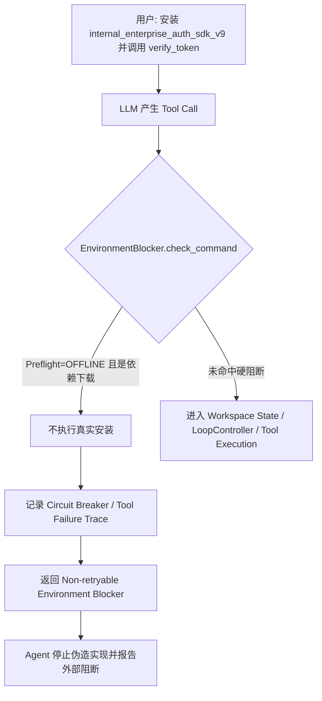

# mini-claude：Agent 失败循环治理——从重复调用到 Progress Governance

> 文档定位：面试学习资料，不是 API 文档。目标是讲清楚这条能力为什么出现、旧方案为什么不够、当前代码到底做了什么、评测如何暴露误杀，以及后续设计如何从“检测重复”逐步收敛为“判断是否还在取得有效进展”。
>
> 事实口径：本文“当前实现”以 `docs/interview-prep` 分支 HEAD `8fd6c1a` 的源码与仓库内评测报告为准；文末“后续 Stop/Continue 实验”来自后续本地实验记录，当前远端分支没有完整包含对应实现与任务集，因此只作为设计演进和实验结论，不与当前分支源码混写。

---

## 一、为什么这条治理线会出现

Coding Agent 的主循环本质上是一个闭环：LLM 根据当前上下文选择 Tool Call，Runtime 执行工具，把 Observation 再交给 LLM，模型继续决定下一步。这个结构只要缺少独立于模型之外的停止条件，就存在一个天然风险：**模型可以一直“做事”，但任务并没有继续向前。**

最典型的失败不是完全相同的命令无限复制，而是“表面动作变化、根因没有变化”。例如一个依赖根本无法从当前环境获得，Agent 可能先执行 `pip install`，失败后换 `pip3`、换镜像、查包、再尝试下载；每条命令都不完全相同，但它们都在重复一个已经没有信息增量的策略。如果 Runtime 只看字符串，就会认为 Agent 一直在尝试新办法；如果只依赖模型自己反思，模型又可能在收到失败 Observation 后继续换皮重试。

仓库里的 `task_015_offline_dependency_block` 就是专门把这个问题压缩成一个可复现 Case：用户要求安装一个公网不存在的 `internal_enterprise_auth_sdk_v9`，并调用其中的 `verify_token()`。Verifier 不要求 Agent “硬做出来”，相反，只要 Agent 没有伪造不存在的认证实现就算正确。这一设计把真正的能力目标从“把任务做完”改成了：**当外部前提不成立时，能否尽早识别阻断并停止无意义尝试。**

```text
用户目标
  ↓
依赖当前环境根本无法获得
  ↓
Agent 仍不断尝试安装 / 下载 / 改命令
  ↓
Tool Call 数、轮次、Token 持续增长
  ↓
但任务状态没有有效进展
```

这里 `max_iterations` 只能解决“最终一定会停”，不能解决“什么时候应该停”。把最大轮次从 40 改成 20，本质上只是缩小最坏成本预算；正常复杂任务也可能需要很多轮，而不可恢复问题可能第 1～3 轮就已经有足够证据。因此这条线真正要解决的是 **Progress Governance**：Runtime 需要判断 Agent 是否仍在产生新的有效信息或新的可验证状态，而不是单纯统计它调用了多少次工具。

---

## 二、第一阶段：直接比较 Tool Name + Args，为什么不够

最初的 `LoopGuard` 很直接：把工具名和参数做稳定 JSON 序列化，在滑动窗口内检测连续重复和高频重复；命中后，本次工具不执行，而是返回一条“重复操作提醒”给模型。这个版本有一个重要价值：**停止权第一次从 Prompt 提醒变成了 Runtime 的物理拦截。** 模型可以不听提示，但它无法绕过 Runtime 去执行已经被拦下的工具。

问题也很明显。对于 Coding Agent，raw args 不是稳定的“行为语义”。下面几条命令字符串不同，但真正想做的事情可能完全一样：

```text
python run_test.py
python -u run_test.py
cd repo && python run_test.py
python run_test.py 2>&1
```

如果直接 Hash 原始参数，会产生大量 False Negative：模型只需要换一个 flag、增加重定向、切换工作目录前缀，就能绕过重复检测。反过来，如果把粒度压得太粗，又会出现 False Positive，例如连续读取同一文件的不同窗口本来是合理探索，却可能被误认为重复。

这次踩坑形成了第一个重要结论：**防循环不能围绕“文本是否相同”建模，而应该围绕“行为意图是否相同”建模。**

---

## 三、第二阶段：从 Raw Args 升级到 Intent Fingerprint

当前分支的主防御不再使用 Legacy `LoopGuard.check()`，而是由 `LoopController` 中的 `CommandNormalizer` 先把 Tool Call 归一化成 `NormalizedIntent`。它只保留三个核心维度：`tool`、`action`、`target`，最终形成一个可比较的 Intent Key。

```python
@dataclass
class NormalizedIntent:
    action: str
    target: str
    tool: str = ""

    def to_key(self) -> str:
        return f"{self.tool}:{self.action}:{self.target}"
```

对于 Bash，归一化会先 token 化，再跳过 `cd`、`set`、`chcp` 等环境前缀，剥离重定向噪声，然后识别 `INSTALL_PACKAGE`、`NETWORK_DOWNLOAD`、`EXECUTE`、`COMPILE`、`VCS` 等 action，并抽取真正的 target。于是不同写法的 `pip install pygame` 可以归一到同一操作意图，而不是继续依赖命令字符串完全相等。

但“归一化”本身也是风险源。项目早期就出现过 `python -c` 粒度过粗的问题：如果只把它识别成 `EXECUTE:-c`，那么对不同文件执行不同 inline script 也会被压成同一 Intent，正常验证被误杀。后续提交 `a99cb2c` 把 `python -c` 的代码内容纳入哈希，并增加任务级 `loop_controller.clear()`；`task_006_cross_file_drift` 中 `loop_guard_trigger_count` 从 3 降到 0。再到 `63880b7`，`read_file` 加入行区间，`search_code` / `count_occurrences` 把 pattern 纳入 target，`edit_file` 把 edits 内容哈希进去，目的都是同一个：**让“相同意图”足够稳定，同时不吞掉正常探索中的关键差异。**

当前分支里几个典型 target 的处理如下：`read_file` 会形成 `file.py:L1-100` 这类范围化目标，搜索工具会追加 pattern hash，`edit_file` 会追加 edits hash；而 `paths` 会对排序后的路径集合做整体哈希。因此，Intent Fingerprint 不是“Tool Name + 文件名”的简单拼接，而是一套针对不同 Tool 语义定制的 canonicalization。

这里的 Trade-off 很明确：归一化过细，模型换皮就能绕过；归一化过粗，正常探索会被误杀。这个系统宁可保留一定 False Negative，也不能把 Runtime Stop 做成高误杀机制，因为 **False Stop 的代价通常高于多执行几轮无效 Tool Call。**

---

## 四、第三阶段：重复行为和重复失败必须拆开建模

Intent Fingerprint 解决的是“Agent 是否又在做同一种事情”，但它回答不了另一个更重要的问题：**为什么失败，以及这种失败是否值得继续重试。**

因此项目引入 Failure Intelligence，把 Tool Result 通过确定性规则归一为 `FailureSignature`。当前源码中的 `FailureCategory` 包括网络不可达、包不存在、超时、权限不足、文件不存在、语法错误、命令不存在、OOM、磁盘满、Tool Crash、参数错误、LoopGuard 虚拟失败以及 Unknown；同时维护 `Recoverability`，区分 `SELF_HEALABLE`、`PARTIALLY_RECOVERABLE`、`USER_INTERVENTION_REQUIRED`、`NON_RECOVERABLE` 和 `UNKNOWN`。

这里不要把 Intent Fingerprint 和 Strategy Fingerprint 混在一起。三层对象解决的问题不同：

| 对象 | 回答的问题 | 典型值 | 用途 |
|---|---|---|---|
| Intent Fingerprint | 这一次具体想做什么？ | `bash:INSTALL_PACKAGE:pygame` | 检测行为级重复 |
| Failure Category | 为什么失败？ | `NETWORK_UNREACHABLE` | 聚合同类根因 |
| Strategy Fingerprint | Agent 在用哪类手段解决？ | `NETWORK_PACKAGE_INSTALL` | 判断是否真的换过策略 |

Failure Intelligence 当前不是 LLM Judge，而是 ordered regex + deterministic rules。原因不是“LLM 做不到分类”，而是停止决策属于 Runtime Control Plane：它需要低延迟、稳定、可单测、可回归。如果把每次 Tool Failure 再交给 LLM 判断是否可恢复，不仅增加调用成本，而且会让停止条件本身变成概率性的。规则无法识别的错误进入 `UNKNOWN`，默认不立即硬杀，这是一种保守设计。

当前 `FailureEscalationPolicy` 主要看三个维度：同类失败累计次数、Strategy Diversity、Recoverability。当前代码中，同一 Category 达到高水位后可直接升级；用户干预型错误在重复出现且策略多样性很低时也会升级；明确 `NON_RECOVERABLE` 则立即升级。这里的“升级”主要是生成系统级 Escalation Message 反馈给 Agent，让它改变策略或向用户报告，并不等价于整个 Agent Loop 一定已经结束。

这形成第二个重要结论：**行为重复和根因重复是两个不同信号。Agent 可以执行不同命令，但仍然被同一个根因困住；也可以执行同一种操作，但 Observation 每次都在改善。单一维度不足以决定 Stop。**

---

## 五、第四阶段：软提醒仍然不够，需要 Runtime 硬熔断

只给模型返回“不要重复”的 Tool Result 仍然存在一个问题：模型可能读到了提醒，却继续换一个近似写法再次调用。于是当前 `LoopController` 又加入了 `CircuitBreaker`，把 LoopGuard 的虚拟失败和真实 Tool Failure 都按 Intent 累积 strike。

当前分支默认参数是：V3 LoopGuard 的 `max_recent=6`、`min_occurrences=4`，也就是当前 Intent 如果在最近窗口中已经出现至少 4 次，本次调用会被物理拦截；CircuitBreaker 默认 `strike_limit=5`。阈值只是工程参数，不是机制本身，面试时没有必要死背数字。真正关键的是：**高风险停止条件不再由 LLM 自己决定，而由 Runtime 抛出 `RuntimeEscalationException` 结束循环。**

```text
重复 Intent / Tool Failure
        ↓
按 Intent Key 累积 strike
        ↓
达到 CircuitBreaker 阈值
        ↓
RuntimeEscalationException
        ↓
trace.final_status = CIRCUIT_BROKEN
        ↓
不再把普通 Tool Result 继续喂给 LLM
```

这里还有一个值得主动讲的实现细节：`edit_file` 的 CircuitBreaker failure key 会按目标文件聚合，而不是按每个 edits hash 完全拆开。这样可以拦住“在同一个文件上不断换一点编辑参数但持续失败”的循环，但也意味着不同合理编辑尝试可能共享 strike。它体现了典型的检测召回率与误杀率 Trade-off，不能把它包装成无损判断。

---

## 六、第五阶段：Environment Blocker，把明确外部阻断前移

Failure Intelligence 仍然是“失败之后再判断”。如果当前会话启动时就能知道网络不可达，那么让模型先失败三五次再升级，本身就是可避免的浪费。因此后续增加了 Preflight + `EnvironmentBlocker`。

`run_preflight()` 会在 Agent 初始化时，用有限时间预算探测网络连通性、当前 Workspace 可写性和相关 Toolchain；`PreflightResult` 一方面写入 Session 记录，一方面转换为 Environment Context 注入 System Prompt。更关键的是，`EnvironmentBlocker.check_command()` 会在 Tool 真正执行前检查：如果已知网络是 `OFFLINE`，而模型仍要执行 pip/npm/cargo/go/maven/gradle 等外部依赖下载命令，就直接返回 Environment Block，不再真的发起安装。

`task_015_offline_dependency_block` 正是这层机制最典型的数据流：



这个机制的收益非常大，但也是后续最需要批判的地方。当前 `EnvironmentBlocker.classify_result()` 把 Package Not Found、Network Unreachable、Permission Denied 都当作明确 Environment Block。现实里这些错误并不总是“永远不可恢复”：权限失败可能通过改路径解决，connection refused 可能是在等本地服务启动，包不存在也可能只是包名写错。因此 **“识别到了一个严重错误”不等于“已经证明整个任务不可恢复”。**

这也是后来设计从“错误类别触发硬停”转向“必须同时考虑 Progress、策略变化和验证证据”的直接原因。

---

## 七、第六阶段：只看 Tool Call 还不够，要看 Workspace 有没有真的变化

另一个真实问题来自编辑类任务。Agent 可以每次都给 `edit_file` 不同参数，从 Intent 层看它似乎一直在探索；但如果每次匹配都失败，Workspace 实际一个字节都没有变化，这依然是空转。

`WorkspaceStateGuard` 为此在写操作前后做 Workspace Snapshot：遍历受管工作区，忽略 `.git`、缓存、虚拟环境、`node_modules` 等噪声目录，对文件内容计算 SHA-256；写操作结束后比较前后 Snapshot，得到 `changed_paths`。当前实现连续 2 次写操作产生 0-Diff 时进入 `write_stalled`，随后在下一次写之前返回 State Stalled Guard；重复读取同一 target 也有独立的连续计数。

```text
write/edit 前 snapshot S0
        ↓
执行 Tool
        ↓
write/edit 后 snapshot S1
        ↓
S0 == S1 ?
   ├─ 否：说明 Workspace 有状态迁移，stall 计数清零
   └─ 是：write_stalls + 1
             ↓
          连续达到阈值
             ↓
       State Stalled Guard
```

这一步把治理从“看模型说了什么、调用了什么”推进到了“看真实外部状态有没有迁移”。`task_016_stalled_code_edit` 就刻意构造两个完全相同的 `divide_numbers` 代码块，只允许 Agent 用 `edit_file` 对共享片段精确匹配并持续重试，期望 Runtime 最终以 `CIRCUIT_BROKEN` 结束。

但是这层机制也暴露了新的反例：**Workspace Diff 仍然不等于 Task Progress。** Agent 完全可以在错误的两种状态之间 A→B→A→B 往返，每次都有 Diff，但业务上没有前进；也可能做了一个合理的格式化或临时脚本写入，Workspace 发生变化，却与任务目标无关。因此 Workspace State 是比 Tool Args 更强的信号，但仍然只能算 Progress Evidence，不能单独当 Progress Truth。

---

## 八、评测是怎么把“误杀”这个问题暴露出来的

最开始如果只设计“应该被熔断”的 Positive Case，很容易得到一个虚假的好系统：阈值设得越激进，通过率越高，因为所有坏任务都被快速杀掉。真正的反循环评测必须同时存在两类用例：

- Must Stop：外部前提不存在、重复失败、状态停滞等，本来就应该尽快终止。
- Must Recover：正常调试、路径纠正、服务等待、跨文件修改等，系统必须允许 Agent 继续探索并最终恢复。

因此评测不能只看“触发了多少次 Guard”，而要把停止判断变成一个二分类问题：该停时停是 TP，该继续时继续是 TN，该继续却被杀是 FP，该停却没停是 FN。对于 Coding Agent，FP 尤其危险，因为它意味着治理层主动破坏了原本可以完成的任务。

当前远端分支可直接核验的一组同 task suite 对账结果来自 `comparison_task016_v4.md`。其中 `task_015` 的目标是外部依赖阻断，Baseline 2/5，通过改造后 5/5；平均轮次 17.4 → 1.0，平均 Token 146.1k → 3.47k。这个数字说明 Environment Blocker 对“明确外部依赖不可获得”这种专项 Case 非常有效，但不能外推成“所有 Coding Task 都能减少 97% Token”。

同一份报告里的 `task_016` 更重要，因为它没有给出漂亮的满分：Baseline 0/5，改造后只有 3/5；平均轮次 6.6 → 4.4，平均 Token 27.8k → 17.7k。结论应该是：**0-Diff State Guard 已经开始发挥作用，但当时的状态停滞识别仍不稳定。** 这比只展示 task_015 的极端收益更适合面试，因为它能说明为什么后面还需要继续改设计。

仓库里更早的 `comparison.md` 还明确提示 baseline/refactor 的 task suite hash 不一致，因此那份汇总不能直接把所有指标变化归因于 Agent 代码。后续对账版让两侧使用相同 task suite hash，才适合作为正式口径。这件事本身也是一个重要工程经验：**Benchmark 不是天然可信的，评测契约、Fixture、Verifier、环境和被测代码一样需要审计。**

另外，历史上曾出现过 `26.3 → 19.7` 之类的轮次数字，那属于其他上下文/工具链实验，不能拿来证明 Failure Loop 治理。面试中必须保证“指标与机制一一对应”，否则数字越多，越容易被追问击穿。

---

## 九、后续本地 Stop/Continue 实验：为什么“更激进”反而更差

以下属于后续本地实验记录，当前 `docs/interview-prep` 远端分支没有完整包含对应源码和 30+ 任务集，因此这里保留的是认知演进，不把它描述成当前分支实现。

后续实验把死循环治理进一步重构成 Stop/Continue 二分类 Benchmark，并加入 DEV/HOLDOUT、Python/JVM/Node/Shell 多类任务、弱 Verifier 修复、Reference Solution、Mutation Test 和 Reference Variants。核心目标从“Guard 能不能触发”改为“Runtime 的 Stop Decision 是否正确”。

第一轮相对保守的版本仍然漏掉不少 Permanent Blocker、伪完成和振荡问题；随后 v2 尝试把“没有 Strong Progress”直接视为 stagnation，结果 DEV×3 上 36/36 全部提前终止，出现 `TP=0, TN=0, FP=18, FN=18`。这个失败非常关键，因为它推翻了一个看似合理的假设：**Neutral Exploration ≠ Stagnation。** 读文件、换搜索范围、确认依赖、等待服务等动作短时间内可能没有 Workspace Diff，却仍然是完成任务所必需的探索。

v3 又引入 Neutral / Attempt / Oscillation 等更完整的状态建模，本地单测看起来更“体系化”，但系统级评测反而继续恶化。原因不是分类器写得不够漂亮，而是 Runtime Stop 处于高风险控制面：只要把不完全可靠的中间信号直接绑定到硬终止，就会放大 False Positive。

最终 v4 的方向不是继续增加更多规则，而是**回退到保守基线，只保留证据最强的两个增量信号**：一类是语义上的 period-2 / period-3 Oscillation，要求多个完整周期且验证没有改善；另一类是 Completion Guard，只在 Agent 宣布任务完成的高证据边界检查是否存在支持性验证。第一次 unsupported completion 不立即判死，而是要求重新规划/验证；重复无证据完成才允许阻断。

冻结 DEV×5 的本地实验记录中，Baseline 有效 Trial 为 58/60，`TP=8, TN=17, FP=11, FN=22`，Accuracy 43.10%；v4 有效 Trial 为 48/60，`TP=9, TN=24, FP=1, FN=14`，Accuracy 68.75%，False Stop 从 11 降到 1，正确 Trial 的平均 Token 约 41.3k → 36.8k。HOLDOUT×5 上，Baseline 为 `TP=2, TN=11, FP=4, FN=6`，v4 为 `TP=0, TN=15, FP=0, FN=6`：Accuracy 提高，但提升几乎全部来自“更少误杀”，对未见过 Permanent Blocker 的召回仍然是 0。

所以后续实验真正证明的不是“v4 已经解决死循环”，而是一个更稳的设计原则：**高风险终止应该优先优化 Precision，而不是盲目追求 Stop Recall；未知场景中，先不误杀正常恢复路径，比多拦住几个可疑循环更重要。**

---

## 十、当前完整机制应该怎么理解

把当前远端分支所有组件串起来，职责边界可以压缩成四层：

```text
LLM
负责：理解任务、选择工具、提出下一步策略
不负责：最终裁决 Runtime 是否必须终止

        ↓ Tool Call

Runtime Control Plane
1. Preflight / EnvironmentBlocker
   - 已知环境事实
   - 对明确外部下载阻断做前置拒绝

2. WorkspaceStateGuard
   - 写前/写后 Snapshot
   - 检测连续 0-Diff 写入、重复读取

3. LoopController
   - CommandNormalizer → Intent Fingerprint
   - V3LoopGuard → 行为级重复拦截
   - CircuitBreaker → 按 Intent 累积 strike 并硬终止

4. Failure Intelligence
   - Failure Category / Recoverability
   - Strategy Fingerprint / FailureMemory
   - 判断同类失败是否值得继续尝试

        ↓ Observation / Escalation / Stop

LLM 下一轮或 Runtime 直接结束
```

这里最值得记住的不是组件名，而是三个观测视角：**Intent 看“做了什么”，Failure 看“为什么失败”，Workspace 看“环境是否发生状态变化”。** 这三者比 raw Tool Call 强很多，但仍然都只是 Progress Evidence。真正可靠的治理必须允许它们互相校验，而不能让任意一个单点信号直接代表“任务已经没有希望”。

---

## 十一、当前方案有哪些真实缺陷

第一，Command Normalization 仍然是规则系统，不具备通用语义理解。`grep → find → rg` 这种“工具不同但业务意图可能相同”的跨工具策略切换，当前不一定能被统一归类。保守放行会留下 False Negative，但如果为了覆盖它而做过度语义合并，又会显著增加 False Positive。

第二，Environment Blocker 对 Permission / Connection / Package Error 的假设仍偏激进。错误类别只能说明“这一次为什么失败”，不能证明“换路径、等服务、换依赖、改配置之后仍会失败”。后续更合理的方向是把这些信号降级为 evidence，再结合状态变化和验证结果决定是否终止。

第三，Workspace Snapshot 的成本随工作区文件规模增长。当前实现虽然忽略常见大目录，但仍然需要对受管文件做 SHA-256；对于大型 Monorepo，这不是可以无限频繁执行的免费操作。后续可以考虑基于受影响路径、文件事件或 Tool 触达集合做增量化，而不是每次全量扫描。

第四，Workspace Diff 只证明“状态变了”，不证明“状态朝目标变好了”。A↔B 振荡、无关文件修改、临时文件反复生成都可能制造假 Progress。后续本地实验中的 Oscillation Detection 正是在补这个缺口。

第五，当前 CircuitBreaker 依赖固定窗口和固定 strike threshold。固定阈值可测试、可解释，但不同任务复杂度和不同 Tool 的合理重试次数并不一致。未来如果要自适应，必须基于可解释 evidence 调整预算，而不是简单让另一个 LLM 动态拍阈值。

第六，Benchmark 仍存在基础设施噪声。后续本地 DEV/HOLDOUT 已经专门把 INFRA Trial 从治理指标中剥离，这说明 Agent Evaluation 必须先回答“这次 Trial 是否有效”，再讨论 Stop Accuracy、Token 和 Latency，否则模型 API timeout、网络抖动会污染算法结论。

---

## 十二、这条线最终沉淀出的可迁移方法论

**1. 不要把“重复”当成字符串问题。** Agent 行为存在大量表面噪声，应该先抽取稳定 Intent，再谈重复检测；但归一化必须保留会改变真实语义的参数，否则治理层会制造误杀。

**2. Stop Decision 和 Action Generation 应该分权。** LLM 适合做开放式策略生成，Runtime 适合执行确定性安全规则和高风险停止裁决。让同一个模型既提出动作又决定自己是否应该继续，很容易形成自我强化循环。

**3. Progress 必须由多个外部证据共同定义。** Tool Call 是否变化、错误类别是否变化、Workspace 是否变化、验证结果是否改善，分别只是不同层面的 evidence。可靠的停止条件应建立在证据组合上，而不是一个布尔规则。

**4. False Stop 是反循环系统的一等指标。** 只用“坏任务是否被拦住”评测，会天然鼓励过度防御。必须同时构造 Must Stop 与 Must Recover，显式统计 FP，并把正常恢复能力纳入回归门禁。

**5. Benchmark 本身也需要版本治理。** task suite hash、Fixture、Verifier、Reference Solution、Trial validity 都属于实验的一部分。评测数据只有在任务集与环境可比时才具有归因意义。

**6. 安全控制面要偏向保守升级。** 对高风险动作，应该优先采用“提醒 → 要求验证 → 再次命中 → 硬停”的分层升级，而不是发现一个模糊信号就立刻结束整个 Agent Loop。

---

## 十三、面试高频追问

### Q1：为什么不用 `max_iterations`，还要做这么复杂的治理？

**为什么会问：** 面试官在判断你做的是不是“换个阈值就能解决”的伪复杂度。

**核心回答：** `max_iterations` 是资源预算上限，只保证最终会停，无法区分“正常复杂任务需要继续”和“不可恢复问题早就应该停止”。治理层解决的是 Stop Timing 和 Stop Correctness，而不是有没有最终兜底。

**追问边界：** 不要说“有 LoopGuard 就不需要 max iterations”。两者职责不同，最大轮次仍然是最终 safety budget。

### Q2：为什么不能直接 Hash Tool Name + Args？

**为什么会问：** 这是 Intent Fingerprint 最核心的设计合理性。

**核心回答：** raw args 对 shell 工具噪声太大，flag、重定向、工作目录前缀都能让同一意图产生不同字符串；但归一化也不能过粗，所以 `read_file` 要保留行区间，搜索保留 pattern，`edit_file` 保留 edits hash。

**追问边界：** 承认规则归一化仍会漏掉跨工具等价策略，不要声称系统能理解任意 Tool Call 的业务语义。

### Q3：Intent Fingerprint 和 Strategy Fingerprint 有什么区别？

**为什么会问：** 两个概念名称相近，很容易暴露是否真的理解实现。

**核心回答：** Intent 是操作级指纹，回答“这次具体做什么”；Strategy 是失败恢复策略的粗粒度分类，回答“Agent 在用哪类手段解决”。Failure Category 再回答“为什么失败”。三者分层后才能区分“同动作重复”和“换动作但根因没变”。

### Q4：为什么软提醒不够？

**为什么会问：** 面试官在看你有没有真正的 Runtime Control 思维。

**核心回答：** Tool Result 里的文字提醒仍然要靠模型遵守，模型可以继续换皮重试。真正的 stop condition 必须由 Runtime enforce，所以 LoopGuard 先物理拦截单次工具，CircuitBreaker 再在证据累计后抛异常结束整个 Agent Loop。

### Q5：为什么 Permission Denied / Connection Refused 不能直接算不可恢复？

**为什么会问：** 这是当前 Environment Blocker 最明显的设计边界。

**核心回答：** Error Category 描述的是一次失败的根因，不是整个任务的可恢复性。Permission 可能换路径解决，Connection Refused 可能只是服务还没启动。后来把这类信号理解为 evidence，而不是无条件 hard stop，就是为了降低 False Stop。

### Q6：Workspace 有 Diff 为什么还可能是死循环？

**为什么会问：** 面试官在看你是否把“状态变化”误当“业务进展”。

**核心回答：** A→B→A→B 每次都有 Diff，但任务并没有前进；无关文件变化也一样。Workspace State 比 Tool Args 更接近真实状态，但仍不等于 Task Progress，必须结合周期、验证结果和目标相关性判断。

### Q7：你怎么证明 Guard 没有误杀正常任务？

**为什么会问：** 这是反循环系统最关键的评测问题。

**核心回答：** 评测必须同时有 Must Stop 和 Must Recover，把 Stop Decision 视为二分类并统计 TP/TN/FP/FN。`task_006_cross_file_drift` 这类正常跨文件修改用于看误熔断；后续 Stop/Continue Benchmark 则把 False Stop 直接作为核心指标。

### Q8：为什么 v2 “没有 Strong Progress 就停”会 36/36 全部提前终止？

**为什么会问：** 这是最能体现认知演进的失败 Case。

**核心回答：** 因为很多合理探索阶段天然只有 Neutral Evidence，例如读文件、换搜索范围、等待服务、确认依赖。没有强证据证明“在前进”并不等于已经证明“停滞”。高风险停止规则不能把 Unknown/Neutral 当 Negative。

### Q9：为什么最终版本反而回退了很多规则？

**为什么会问：** 面试官会质疑“删功能是不是退步”。

**核心回答：** Runtime Stop 的 FP 成本高于普通 FN。v3 虽然架构更丰富，但系统级误杀更严重，所以最终保留只有高证据边界才启用的 Oscillation 和 Completion Guard。治理系统不是规则越多越强，而是决策校准越好越强。

### Q10：task_015 的 Token 为什么能从 146k 降到 3.5k，这能代表全局收益吗？

**为什么会问：** 面试官在检查你有没有用极端 Case 包装整体效果。

**核心回答：** 不能代表全局。这是 failure-specific Benchmark：Baseline 会在不存在的依赖上反复下载，而改造后 Preflight/Environment Blocker 第一轮附近就能识别外部硬阻断，所以专项收益非常大。它只证明该机制对这类 Case 有效，不能外推到普通 Coding Task。

### Q11：为什么你说 Benchmark 自己也会有 Bug？

**为什么会问：** 高质量评测体系通常比写几个 testcase 更难。

**核心回答：** 因为 Verifier 可能只检查表象、task suite 可能变化、Reference Solution 可能不完整、模型 API 失败也可能被误算成算法失败。仓库早期 comparison 就出现 task suite hash 不一致，后面才做同 suite 对账。实验系统本身必须有 provenance 和 validity gate。

### Q12：如果继续做，你下一步会改什么？

**为什么会问：** 不是要听“加更多 AI”，而是看你是否知道当前架构最薄弱的地方。

**核心回答：** 第一优先级是把 Environment Blocker 从“单次错误类别→hard stop”降成 evidence accumulation；第二是把 Workspace Snapshot 做增量化；第三是用 verification progress 和 semantic oscillation 补足“Diff≠Progress”；第四是继续扩大 hidden holdout，而不是先加一个 LLM Judge。

---

## 十四、简历怎么写，才不会给自己挖坑

如果以当前远端分支可直接核验能力为口径，推荐写：

> **Agent 失败循环治理：**针对 Coding Agent 在外部依赖不可达、重复工具调用及连续无效编辑场景中的空转问题，设计 Runtime 级循环治理机制：将 Tool Call 归一化为 Intent Fingerprint，结合 Failure Category / Strategy Fingerprint、环境 Preflight 与 Workspace Snapshot 识别重复行为、同类失败和 0-Diff 状态停滞，并通过 Circuit Breaker 对高置信循环执行硬熔断；专项离线依赖 Benchmark 中通过率由 2/5 提升至 5/5，平均轮次由 17.4 降至 1.0。

这句话的边界要主动守住：`2/5 → 5/5、17.4 → 1.0` 只属于 `task_015_offline_dependency_block` 专项 Benchmark，不代表全任务集；`task_016` 当时只有 0/5 → 3/5，所以不要写成“状态停滞已完全解决”；后续 DEV/HOLDOUT 的 Stop/Continue 数据如果简历要引用，必须明确它来自后续本地实验，不要与当前远端分支实现混为一谈。

如果面试官只允许 30 秒，最终可以收口成一句话：**我做的不是简单的“重复 N 次就停”，而是把 Agent 的停止权从模型侧下沉到 Runtime，用 Intent、Failure 和 Workspace 三类确定性证据判断它到底是在正常探索，还是已经失去有效进展；后续评测又反过来证明，死循环治理最危险的问题不是漏拦，而是误杀本来能恢复的任务。**
