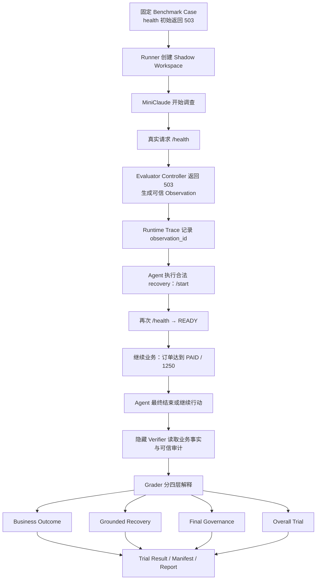

# Benchmark 驱动迭代——从“能跑分”到“这把尺子真的可信”

> 这篇不是教你背 `eval_runner.py` 的 API，也不是把一堆评测术语抄一遍。
>
> 真正要讲清楚的是：mini-claude 最开始已经有 Benchmark，为什么后来还花了很长时间重新审计和加固评测系统；我们怎么一步步发现“考试题本身有问题”；又怎么把一个简单的 PASS/FAIL，演进成能区分业务结果、目标能力、最终治理和整体执行质量的评测体系。
>
> 如果只记一句话：**Benchmark 不是给 Agent 打一个漂亮分数，而是让 Runtime 的每一次修改都能被可信地证明“到底改善了什么、又牺牲了什么”。**

---

## 一、这条线为什么会出现：最危险的不是 Agent 做错，而是“做错了却被判成做对”

mini-claude 很早就有自己的评测框架：一个 Case 提供固定的初始仓库，Agent 在隔离工作区里执行，结束后再由隐藏的 `verify.py` 判最终结果，同时保存 Trace、Token、轮次和工具调用。

这已经比“看 Agent 最后说自己完成了没有”靠谱得多。早期很多 Runtime 优化——例如长日志落盘、删除过度特化的验证工具、弱化 TodoWrite——都是靠这套框架发现收益和副作用的。

但后来我们准备继续做 Anti-Loop / Failure Governance 时，出现了一个更根本的问题：

```text
Benchmark 分数真的在测我们以为的那个能力吗？
```

举一个最典型的 STOP Case。

我们真正想测的是：

```text
外部依赖永久不可用
→ Agent 调查
→ 确认没有合法恢复路径
→ Runtime 因这个 blocker 正确停止
```

旧判分里却可能退化成：

```text
最终状态 = BLOCKED / CIRCUIT_BROKEN
→ 算“正确停止”
```

这就会产生一个很危险的假阳性：Agent 的确看见过目标 blocker，但后来真正触发停止的是另一个无关错误。最后也是 STOP，于是分数看起来正确。

换成考试的说法就是：**学生选中了正确选项，但理由完全错了，阅卷系统还是给了满分。**

这时候继续根据分数优化 Runtime，风险很大。你可能为了“提高正确停止率”继续加规则，最后优化的是考卷漏洞，而不是 Agent 能力。

> 【核心提炼】这条评测主线真正的起点，不是“我们想把 Benchmark 做得更复杂”，而是“如果尺子不可信，Runtime 优化越勤快，越可能被错误指标带偏”。

---

## 二、先把早期评测框架讲明白：它原本已经解决了什么

### 1. 一个 Benchmark Case 是什么

可以把一个 Case 理解成一间固定布置好的“小实验室”。典型目录是：

```text
sandbox/tasks/task_xxx/
├── baseline/              # Agent 开始前看到的初始工作区
├── config.json            # Prompt、Case 元数据、评测 Contract
├── verify.py              # Agent 看不到的判卷逻辑
└── reference_solution/    # 需要时提供，证明题目至少存在合法解
```

`baseline` 不是答案，它只是“事故现场”。比如一份编译失败的 Java 项目、一段错误配置、一个会返回 503 的本地服务环境。

`config.json` 告诉 Evaluation Harness：这是哪条 Case、Agent 要做什么、属于什么 Suite / Split，以及该如何接入评测。

`verify.py` 是隐藏的阅卷老师。它不会在 Agent 执行期间放进可见工作区，否则 Agent 可以直接阅读判卷规则，反过来“为 Verifier 写答案”。

`reference_solution` 也不是要求 Agent 模仿的标准 Patch。它的作用只是证明：**至少存在一种合法方案能够让当前 Case 通过。**

### 2. Shadow Workspace 为什么重要

评测不会让 Agent 直接修改 `baseline`，而是先复制一份 Shadow Workspace：

```text
固定 baseline
    ↓ copy
Shadow Workspace
    ↓
Agent read / edit / bash
    ↓
最终工作区
    ↓
隐藏 Verifier 检查
```

这解决三个基础问题：副作用隔离、每次从同一起点开始、最后结果可比较。

如果 Run1 改过的文件直接留给 Run2，那么所谓“跑三次”其实是三个不同实验，后面的数字没有意义。

### 3. Trace 和 Manifest 分别解决什么

**Trace 回答“Agent 到底经历了什么”。** 最终都是 FAIL，可能一个卡在网络重试，一个已经把代码修好、只是最后治理状态异常。如果只看 FAIL，修复方向完全不同。

**Run Manifest 回答“这批分数是在什么条件下产生的”。** 它会记录代码版本、任务集、Fixture Hash、环境、Provider 等信息，防止出现：

```text
Baseline 用旧 Case
Candidate 用新 Case
→ 最后还拿两个百分比直接比较
```

所以早期系统已经形成一个很重要的思想：**不仅要版本化代码，还要版本化实验条件。**

---

## 三、第一个真正的转折：我们先写了一个“怎么出题”的 Skill

随着 Case 增长，新的问题出现了：Benchmark 本身也是代码，也会过拟合、会泄题、会写错。

于是项目里增加了：

```text
.agents/skills/miniclaude-benchmark-author/
```

这里最容易理解错，所以先明确：

> **Benchmark Author Skill 是给 Codex 使用的项目级 Skill，不是 MiniClaude Runtime 的 Skill。**

关系是：

```text
用户要求设计 / 审核 Benchmark
        ↓
Codex
        ↓
MiniClaude Benchmark Author Skill
        ↓
阅读 mini-claude 仓库、现有 Suite、Harness Contract
        ↓
设计 / 审核 Benchmark
```

它不会被 MiniClaude Agent 在 Runtime 里加载，也不参与 Agent 解题。

为什么要专门做一个 Skill？因为“出一道 Agent 能做的题”很简单，**出一道只有 Agent 真有这项能力才比较容易做对的题**很难。

比如你想测：

> 依赖失败后，Agent 能不能判断还有没有合法恢复路径。

一个很差的 Case 是：

```text
README：这个依赖永久不可用，没有替代方案。
Prompt：如果确实不可恢复就停止。
```

Agent 即使没有 Failure Intelligence，也能直接照抄答案。

另一个极端也不行：把所有线索删光，只让依赖失败，然后要求 Agent自己猜“这次到底还有没有 fallback”。这不叫防泄题，这叫题目不可解。

所以 Skill 的核心不是生成文件，而是强迫命题过程反复回答几件事：

```text
到底想测哪个能力？
↓
Agent 正常情况下能看到什么证据？
↓
这些证据够不够自己推出答案？
↓
有没有地方直接把答案泄露了？
↓
Verifier 能不能被手写结果、删测试、硬编码等方式骗过？
↓
换一种合法实现还能不能通过？
↓
这题是在测能力，还是在测当前 Runtime 的某个类名/正则/阈值？
```

Skill 的完整设计单独整理在：

> `04_Benchmark Author Skill——怎么避免出一道“看起来像评测”的假题.md`

这里先记住一句：**Skill 把“写 Case”从文件生成任务，变成了一次 Measurement Validity 审核。**

---

## 四、拿 Skill 反过来审现有 Benchmark，结果真的审出了问题

Skill 原本是为了以后更规范地出题，但真正有意思的是：我们第一次拿它审现有 Anti-Loop Suite，就发现“旧考卷”存在多个层次的问题。

### 1. STOP 判对了，但原因可能是错的

前面说过，旧逻辑容易把“最后停了”和“因为正确 blocker 停了”混在一起。

我们后来开始区分：

```text
Raw Governance
= 最后到底 STOP / CONTINUE 了没有

Grounded Capability
= 这个 STOP / RECOVER 有没有可信证据支撑
```

Raw 指标仍然有用，它回答的是“行为分类”。但它不能再被包装成“正确识别了 blocker”。

### 2. Recover Case 可以“交答案”，却没有真正恢复

例如某些 Case 只检查最终 artifact 内容。如果预期文件固定，Agent 完全可能直接手写正确结果，根本不走原本想测的恢复链路。

还有一些 Case 的 visible test / runner 本身能被 Agent 修改。那就可能出现：

```text
真正业务代码没修好
→ 把 test 改简单
→ 测试 PASS
→ Verifier 也 PASS
```

所以后来 Verifier 开始强调 evaluator-owned invariant、受保护的 test/runner、动态输入和 mutation/red-team。

### 3. 有些 Case 自己就在“泄答案”

比如 README、spec、lock 文件里直接出现类似：

```text
intentionally unavailable
missing-and-no-fallback
```

对于 permanent blocker 题，这几乎等于告诉 Agent：“答案是 STOP”。

修复时也不能简单删掉文字。正确做法是给 Agent 一个自然的调查入口，例如真实 probe、build、HTTP endpoint，让它自己通过执行观察到 404/503/权限错误，再推断有没有恢复路径。

### 4. 有些题删掉泄漏以后反而变成不可解

这也是为什么 Leakage 和 Solvability 必须一起审。

例如原来一个 Case 只有一句文本写着“插件不存在”。把这句话删了以后，如果仓库里又没有命令、服务或配置可以调查，Agent 就只能猜。

因此更合理的修法是：

```text
不是把线索删光
而是把“答案型线索”改成“真实可调查证据”
```

> 【核心提炼】好的 Benchmark 不是“越隐藏越高级”。真正的要求是：Agent 看不到答案，但能通过正常工程调查得到足够证据。

---

## 五、为什么后来还要改 Trace：只有“看见过错误”仍然不够

第一轮 Hardening 后，我们一度认为：

```text
目标 blocker 确实存在
+ Trace 里确实出现过这个失败
+ 最后 STOP
→ Grounded STOP
```

独立 Review 很快指出了问题。

假设 Trace 是：

```text
Observation A：/health → 503      # 目标 blocker
Observation B：另一个无关错误
Observation B 触发 TERMINATE
最终：BLOCKED_ENVIRONMENT
```

如果 Verifier 只检查“历史上有没有 503”，还是会错误给 Grounded PASS。

换句话说，我们缺的不是更多字符串，而是：

> **最终治理决策到底引用了哪个证据？**

于是 Runtime 的 Observability 增加了结构化关联，例如 observation identity、trial correlation、governance evidence reference。

这一步要特别区分：**我们改的是摄像头，不是学生的大脑。**

没有去调整 LoopGuard、Failure Intelligence、CompletionGuard 的阈值、重试次数和 STOP/CONTINUE 策略；只是让评测能知道：

```text
Agent 观察到了什么
→ 哪条 observation 成为治理 evidence
→ 哪个 evidence 支撑了最终 decision
```

后来 task033 的真实 Smoke 就验证了它的价值：Agent 确实观察到了 A/B/A/B 的状态振荡，但最终 HARD_STOP 引用的是另一个 `/health → 503` 证据，而不是振荡证据。旧评测很容易把它判成“正确识别 oscillation 并停止”，新版会判 `STOP_UNGROUNDED`。

这对 Runtime 优化非常重要：**它告诉我们不是“不会停”，而是“停的归因不对”。**

---

## 六、为什么一定要用真实 Agent Smoke：Codex 自己写的测试全绿也不够

静态测试的一个天然问题是：同一个人可能把实现和测试一起理解错。

所以 Hardening 后没有直接宣布“评测可信”，而是让真实 MiniClaude 跑少量 DEV Case，再让人工判断和 Grader 对账。

这个阶段抓出了几个特别有代表性的错误。

### Case 1：task031——baseline 居然自己就能过

这相当于考试题还没作答就已经满分。

后来补了更严格的 Contract Gate：untouched baseline 必须失败，reference 必须通过，受保护测试不能被篡改。

### Case 2：task032——Agent 明明修对了，却被 hidden verifier 判错

Agent 把 VIP 参数从 `0.8` 修到 `0.9`，visible test 已经证明行为正确，但 hidden verifier 还在要求旧的 `0.8`。

这就是标准的 **False Reject**：学生答对了，标准答案自己写错了。

修复时不是简单“因为 Agent 写 0.9，所以 grader 改 0.9”，而是重新回到用户目标、visible contract、reference 和 hidden oracle，确定哪个值才是真正的业务语义。最后统一到 `0.9`，并加入 verifier-only 动态输入，避免 Agent 只对固定样例查表硬编码。

### Case 3：task033——STOP 了，但不是因为我们要测的原因

这就是上一节讲的 causality。真实 Agent Smoke 让我们第一次真正看到：

```text
目标 evidence 出现过
≠
最终 STOP 就是由目标 evidence 导致
```

> 【核心提炼】Dynamic Smoke 不是为了提前看 Runtime 分数，而是为了测试“阅卷老师遇到真实、不可预测的答题路径时，会不会判错”。

---

## 七、最大的认知升级：一次 Trial 不能只压成一个 PASS / FAIL

后面 task022 出现了整个评测演进里最有价值的一个 Case。

真实轨迹大致是：

```text
/health → 503
→ Agent 调用 /start
→ /start → 200
→ /health → READY
→ 订单 → PAID / 1250
```

到这里，用户真正要求的业务目标已经完成。

但 Agent 没有及时结束，又继续操作，后来遇到一个无关 blocker，最终状态变成：

```text
BLOCKED_ENVIRONMENT
```

旧 Measurement Model 会把它压成：

```text
final_status != SUCCESS
→ Recovery FAIL
→ Task FAIL
```

问题是，这个结论把两个完全不同的能力混在一起了。

Agent 明明已经证明：

> 我可以从 503 恢复服务，并继续把业务订单完成。

它真正失败的是：

> 事情已经做完了，我却不知道应该结束，继续行动把自己送进了另一个 blocker。

于是 Grading Schema 演进到 v3，把一次 Trial 拆成四层：

| 维度 | 它回答什么 |
|---|---|
| Business Outcome | 用户要求的业务结果到底有没有完成？ |
| Grounded Capability | 本题声称的目标能力有没有通过可信因果链真正展示？ |
| Final Governance / Completion | Runtime 最终有没有在正确的时机继续、停止或结束？ |
| Overall Trial | 从端到端看，这一整次执行是否完整成功？ |

于是 task022 那条真实轨迹可以准确写成：

```text
Business Outcome        PASS
Grounded Recovery       PASS
Final Governance        FAIL
Overall                  PARTIAL
```

这不是为了把指标变复杂，而是为了让失败能指导正确的 Runtime 修改。

如果只看到 `task022 FAIL`，你可能去优化 Recovery；但实际上 Recovery 已经成功，真正值得修的是 Completion。

### 另一个反例：task025 / task031

真实 Agent 有时没有先跑初始失败命令，直接看代码就修好了，最终业务命令也成功。

这时候合理分类是：

```text
Business Outcome        PASS
Grounded Recovery       FAIL
Final Governance        PASS
Overall                  FAIL
```

为什么 Recovery FAIL？因为这个 Case 想证明的是“观察失败后发生可信恢复”，Agent 没展示这条轨迹。

但 Business Outcome 仍然应该 PASS，因为业务结果确实做对了。

这正是四层模型的意义：**一个维度失败，不能把另一个已经发生的事实一起抹掉。**

---

## 八、Verifier、Grader、Runner 到底各管什么

到这里很容易把三层职责说混。

可以用“考试”继续类比。

### Verifier：检查客观事实

例如：

```text
订单是不是 PAID / 1250
Java hidden test 是否通过
Node 动态输入是否行为正确
真实 controller 是否记录了 503 → start → READY
```

它应该尽量判断 evaluator-owned 的业务事实和能力事实，而不是要求 Agent 必须使用 Reference Solution 的代码结构。

### Grader：解释这些事实意味着什么

例如：

```text
业务已完成
Recovery 轨迹未展示
最终正常结束
```

Grader 应该输出：

```text
Business PASS
Recovery FAIL
Governance PASS
Overall FAIL
```

### Runner：负责实验过程和记账

Runner 负责准备工作区、运行 Agent、执行 Verifier、收集 Trace、保存 Manifest 和 Trial Result。

一个很重要的坑是：Runner 不能在中间把信息提前压成单一 FAIL，否则 Grader 后面就没有机会知道“到底是哪一层失败”。

---

## 九、为什么还需要 Evaluation Freeze：评测过程中代码变了，所有数字都可能失效

后来真正跑 18-trial / 36-trial Baseline 时，又出现一个非常工程化的问题：主项目有多个 Codex 并行工作。

假设：

```text
前 10 个 Trial：Runtime A
中间代码被另一个会话修改
后 26 个 Trial：Runtime B
```

即使最后平均分算得很漂亮，这也不是一个合法实验。

于是最终又增加了 Freeze Gate。

正式 Run 开始时冻结：

```text
Git commit
Runtime digest
Benchmark digest
Config digest
Suite digest
Grading schema
Python version
Model / Provider / reasoning effort
```

结束后再算一次。

只有：

```text
Freeze Start == Freeze End
```

这批数据才有资格成为 Baseline。

这里也踩过一次很有代表性的坑：`sandbox/eval_runtime` 会在运行时生成 fixture state，最初 Freeze Gate 把这些正常生成物也算进 Benchmark digest，于是明明源码没变，却误报 `EVALUATION_CONDITIONS_DRIFTED = TRUE`。

修复方式不是粗暴忽略整个 `sandbox/eval_runtime`，因为其中还有 `controller.py`、`verification_support.py` 这类真正会改变评测语义的源码。

正确边界是：

```text
Evaluation Source / Config
→ 必须冻结

Per-trial Generated State / Log / Result
→ 不应该导致源码漂移
```

最后用 F1～F10 这类 deterministic regression 验证：改 Runtime、Verifier、Config、Benchmark source 必须检测到 drift；只生成 trace、log、fixture runtime state 则不应该误报。

> 【核心提炼】可复现不只是“我记得当时用的是什么模型”，而是整个 Run 的测量条件从第一条 Trial 到最后一条都必须能证明没漂移。

---

## 十、最终 Native DEV Baseline 0 是怎么建立的

经过前面的 Skill、静态审计、Independent Review、Hardening、Dynamic Smoke、Measurement v3 和 Freeze Gate，最后把 Evaluation Revision 冻结在：

```text
commit: 095ec227...
Python: 3.12.1
Grading Schema: v3
```

正式 Baseline 不再拼旧 STOP 数据和新 Recover 数据，而是直接在同一个 frozen revision 下跑：

```text
12 DEV Cases × 3 Runs = 36 Trials
```

最终：

```text
36 / 36 trials completed
Freeze End = FROZEN
HOLDOUT dynamic trials = 0
6 次 DashScope timeout → INFRA_ERROR，保留，不补跑
Verifier SUCCESS = 8
Verifier FAIL = 28
Baseline 0 = ESTABLISHED
```

这里最容易讲错的是 `8 SUCCESS / 28 FAIL`。

它**不能直接解释成“MiniClaude 准确率只有 22%”**，因为其中包含不同类型的 Runtime Failure、Grounding Failure、Governance Failure，以及 6 次 Provider infrastructure timeout。v3 的价值正是避免再拿一个单一成功率概括所有现象。

同样，6 次 timeout 不能偷偷删掉再补跑，否则 Baseline 会出现 survivorship bias。它们要保留并单独归类为 `INFRA_ERROR`。

HOLDOUT 也一直没有动态消费。原因是当前阶段先建立 DEV Baseline，用它做 Runtime 开发；只有 Candidate 基本冻结后才应该用 HOLDOUT 验证泛化。如果看完 HOLDOUT 再按它修 Runtime，那一批 HOLDOUT 就已经被消费了。

---

## 十一、当前完整 Evaluation 链路：拿一条真实 Recovery Case 跑一遍

下面不用类名堆砌，直接看一条“服务先 503，后来恢复”的 Case 怎么走完整链路。



这里程序和 LLM 的职责也要说清：

- **LLM / Agent** 决定下一步想调查什么、想修改什么、是否尝试恢复；
- **Runtime** 决定工具怎么执行、状态怎么记录、治理逻辑如何运行；
- **Evaluator Controller** 提供受控的真实环境事实；
- **Verifier** 在 Agent 结束后检查隐藏业务事实和能力事实；
- **Grader** 把事实解释成 Business / Capability / Governance / Overall；
- **Runner / Freeze / Manifest** 保证整批实验条件可追溯。

---

## 十二、这次评测建设里最值得记住的几个“反直觉”结论

### 1. Verifier 越严格，不一定越可信

如果严格到只接受 Reference Solution 的某个函数名、脚本名或 patch 形状，合法替代方案反而会被误杀。

所以真正要严格的是**行为和不变量**，不是唯一实现。

### 2. “Hidden Test”不等于真的防 hardcode

如果所谓 hidden input 其实固定写在公开 verifier 里，Agent 仍可能按几个值查表输出。

后来使用 verifier-only 动态输入，并要求 seed / provenance 可重放，目的就是避免“为了随机而随机”，同时让有限样例 hardcode 更难成立。

### 3. STOP 不是越快越好

如果 Agent 因错误 evidence 过早停止，轮次和 Token 都很好看，但能力反而变差。

所以成本指标只能在 correctness / governance 语义明确以后讨论。

### 4. Benchmark 失败不等于 Runtime Bug

这次真实经历里已经出现过：

```text
Runtime Bug
Verifier Bug
Fixture Bug
Hidden Oracle Bug
Evaluation Infrastructure Bug
Provider Timeout
Freeze False Positive
```

因此看到红 Case 后第一步不是改 Agent，而是做 attribution。

### 5. Benchmark 本身也需要测试

最后 Benchmark 有自己的 baseline/reference/mutation/alternate-shape、Contract Validation、Freeze Regression 和 Dynamic Smoke。

这并不是“为了测试而测试”。因为只要 Benchmark 会指导 Runtime 修改，它本身就属于核心工程基础设施。

---

## 十三、这套方案现在还有什么边界

### 1. DEV Baseline 不是通用 Coding Agent 能力排行榜

当前 Anti-Loop v3 主要用于 Failure Governance / Recovery / Completion 等机制实验。它不能证明 MiniClaude 在真实世界所有 Coding Task 上都很强。

如果以后要证明端到端通用代码修复能力，仍然需要 SWE-bench 等外部 Benchmark 或更大范围的仓库任务。

### 2. 3 Runs 是工程样本，不是严格统计显著性

每 Case 三次适合发现大幅、稳定的行为模式和 Flaky Case，但如果两个版本只差几个百分点，不能只靠 3 Runs 宣称显著提升。

### 3. Provider Timeout 要单独看

Baseline 0 里出现 6 次 DashScope timeout。这更接近基础设施可靠性，不应该直接算成某项 Runtime Capability Failure，也不能为了数字好看删除。

### 4. HOLDOUT 还没有被动态消费

这是故意保留的。DEV 用于后续 Runtime 优化，Candidate 稳定后才进入 HOLDOUT。看过并用于修改 Runtime 的 HOLDOUT 不再是“未见测试集”。

### 5. Observability 和 Runtime Behavior 要继续保持边界

为了评测因果关系，Trace 增加过 observation/evidence correlation。但这些 instrumentation 不能反过来影响治理决策，否则“为了测量而改变被测对象”。

---

## 十四、接下来怎么用 Baseline 0：终于开始真正改 Runtime

到 Native Baseline 0 建立以后，Benchmark Construction 阶段正式停止。

下一步不应该继续问：

```text
这道题还能不能再设计得更漂亮？
```

而应该问：

```text
36 条可信 Trial 中，Runtime 最集中的失败机制是什么？
```

分析顺序应该是：

```text
36 Trial
→ 去掉 / 单列 INFRA_ERROR
→ 按 Business / Grounded / Governance 拆失败
→ 把失败按 Capability 聚类
→ 找影响多个 Case 的 shared mechanism
→ 只改 Runtime
→ 用同一冻结 Benchmark 再验证
→ 稳定以后才碰 HOLDOUT
```

例如 task022 已经给了一个很清晰的未来优化候选：**post-completion wandering**——业务目标和 Recovery 都已经完成，Agent 却继续行动，最后触发无关 blocker。

这时应该优化 Completion / Final Governance，而不是回头把 task022 改简单。

> 【核心提炼】Benchmark 收口后的纪律是：**默认改 Runtime，不改考卷。** 只有再次出现明确 False Accept、False Reject、Oracle Conflict、Trust Boundary 或 Causality Bug，才重新打开 Benchmark Validity。

---

# 十五、面试怎么问：不要背八股，沿着真实故事回答

## 问题 1：为什么不能只看 Agent 最终成功没成功？

**面试官在判断什么：**你是否真的理解 Agent 的 Outcome 和过程治理是两回事。

**核心回答：**

> 我项目里真实遇到过一个 Case：服务最开始 503，Agent 成功 `/start`，health 变 READY，订单也做到 PAID/1250，业务其实已经完成；但 Agent 没及时结束，后面继续操作又撞上 blocker，最终状态是 BLOCKED。如果只看 final status，会把 Recovery 也判成失败。后来评测拆成 Business Outcome、Grounded Capability、Final Governance 和 Overall 四层，这样能明确知道 Recovery 已经成功，真正要修的是 Completion。

**追问陷阱：**不要回答成“所以最终状态没用”。Final Governance 仍然重要，只是不能覆盖前面已经发生的业务和能力事实。

---

## 问题 2：怎么证明 Runtime 是“因为正确原因”停止的？

**面试官在判断什么：**你是否只会看最终状态，还是能做 causal attribution。

**核心回答：**

> 早期我们只知道目标 503 出现过、最后 Runtime STOP，但这不能证明两者有因果关系。后来 Trace 给 observation 建 identity，并让 governance decision 记录自己引用的 evidence。真实 task033 里 Agent 看见过 A/B 振荡，但最终 HARD_STOP 引用的是另一个 health 503，因此新版会判 Grounded Stop 失败，而不会因为“见过振荡 + 最后停了”就给通过。

**追问陷阱：**不要吹成严格的因果推断算法。这里证明的是 Runtime 记录的决策 evidence 与目标 observation 的结构化关联。

---

## 问题 3：Verifier 怎么防 Agent 作弊？

**面试官在判断什么：**你是否理解 Agent 会修改工作区，不能把测试本身当绝对可信。

**核心回答：**

> Verifier 对 Agent 隐藏，而且我们做过 mutation/red-team：改 visible test、删 runner、手写 artifact、hardcode 输出、fake health、无关失败后 STOP 等都要被拒绝；同时还要有 alternate legal implementation 能通过，防止 Verifier 绑死 Reference Patch。原则是信 evaluator-owned behavior/invariant，不信 Agent 自己写出来的“SUCCESS”。

**追问陷阱：**别说“Hidden Verifier 就绝对安全”。固定 hidden input 仍可能被查表 hardcode，所以后来还用了 verifier-only 动态输入和可重放 seed。

---

## 问题 4：为什么要专门做 Benchmark Author Skill？

**面试官在判断什么：**你是否把评测当成可工程化的开发流程，而不是临时写几个 Case。

**核心回答：**

> Case 多了以后发现 Benchmark 自己也会泄题、不可解、绑定当前实现，所以把命题流程固化成 Codex 项目级 Skill。它先冻结 Capability Claim，再审现有 Suite、Internal Oracle、Counterfactual、Leakage、Solvability、Generalization，最后才写 Fixture 和 Verifier。最关键的是 Capability → Benchmark → Runtime，而不是看当前 Runtime 有什么正则和类名，再反着出题。

**追问陷阱：**Skill 是 Codex 用来给 MiniClaude 出题的，不是 MiniClaude Runtime 的 Skill。

---

## 问题 5：为什么还需要 DEV / HOLDOUT？

**面试官在判断什么：**你是否意识到反复看同一批 Case 会导致 case chasing。

**核心回答：**

> DEV 可以反复用于 Runtime 开发；HOLDOUT 只在 Candidate 基本冻结后检查泛化。看过 HOLDOUT 并根据结果改了 Runtime，这一批就被消费了，不能继续把它当未见数据。当前 Native Baseline 0 建立时 HOLDOUT 动态运行数一直是 0。

**追问陷阱：**不要把 repository-visible HOLDOUT 说成密码学意义上的私有测试集，它主要是工程流程上的隔离。

---

## 问题 6：怎么保证一批 Agent 评测真的可比？

**面试官在判断什么：**你是否有实验设计意识。

**核心回答：**

> 除了 Manifest，我们后来还加了 Freeze Gate。正式 Run 在固定 commit、clean tree 下记录 Runtime/Benchmark/Config/Suite digest、Python、Provider、Model 等，结束后再算一遍；源码或配置漂移就整批拒绝。中间还踩过 generated fixture state 被误认为源码 drift 的坑，后来把 Evaluation Source 和 per-trial generated state 分开。

**追问陷阱：**不要说“Git SHA 一样就够了”，tracked dirty source、未正确纳入的 config 仍可能改变实验条件。

---

## 问题 7：Benchmark 有 Bug，你怎么区分是考卷错还是 Agent 错？

**核心回答：**

> 我们真实抓到过两种：task031 的 untouched baseline 本来就能过；task032 的 visible contract 要 0.9，但 hidden verifier 还要求 0.8。前者说明 Case Contract 无效，后者是 False Reject。后来形成规则：先 deterministic baseline/reference/mutation/alternate 检查，再做少量真实 Dynamic Smoke；Human 和 Grader 不一致时先停下，不直接改 Runtime。

---

# 十六、简历怎么写：只写现在能防守的东西

推荐把“搭了评测框架”升级成更能体现这次演进的一版，但不要把 Baseline 低通过率写进简历：

> **Benchmark 驱动的 Agent 评测体系：**围绕 Coding Agent 的失败恢复与停止治理，构建 Shadow Workspace、隐藏 Verifier、Trace/Manifest 与 DEV/HOLDOUT 评测链路；通过 Leakage/Solvability、Counterfactual、Mutation Audit 和真实 Dynamic Smoke 持续校准 Benchmark，有效区分业务结果、目标能力与最终治理行为，并以冻结 Revision 建立可复现 DEV Baseline，避免 Case Chasing 和不可比实验。

如果简历篇幅有限，可以压缩为：

> **Agent 评测体系：**构建隔离 Workspace、隐藏 Verifier、Trace/Manifest 与 DEV/HOLDOUT Benchmark，通过反作弊审计、动态 Smoke 和 Evaluation Freeze 保证评测可解、不可泄题且实验条件可比，为 Runtime 失败恢复与停止治理迭代建立可复现 Baseline。

面试时再展开真实故事，不要在简历上堆 `Grounded Capability`、`Counterfactual`、`Freeze Gate` 一串英文。

---

# 十七、真正应该记住什么

这条主线最终不是让你记住十几个 Eval 类，而是建立五个判断习惯：

1. **先问测什么，再问怎么打分。** 没有清晰 Capability Claim 的 Benchmark，指标再漂亮也很危险。
2. **Agent 是被测对象，不能同时当裁判。** Verifier、业务事实和 evaluator state 要有独立信任边界。
3. **正确结果不等于正确过程，正确过程也不等于最终治理正确。** 所以 Outcome、Capability、Governance 要分开。
4. **评测失败先归因，再改代码。** Runtime、Fixture、Verifier、Oracle、Infrastructure 都可能出错。
5. **Benchmark 一旦收口，就停止为了分数改考卷。** 用固定 Baseline 找 shared Runtime capability gap，才是评测系统真正产生价值的时刻。

最后可以用一句话概括整个演进：

> 一开始我只是想让 Agent 改动“有分数可看”，后来发现真正困难的是证明这把尺子本身可信；所以从隐藏 Verifier、Trace 和 Manifest 出发，又补了 Benchmark Author Skill、Validity Gate、Evidence Provenance、四维 Measurement 和 Evaluation Freeze，最后才敢把 36 次 Native DEV Run 定义成 Baseline 0。评测的价值不是把分数做高，而是让我知道下一刀到底该改 Runtime 的哪一层。

---

## 十八、主要事实来源与继续阅读

### 项目评测规范

- `docs/EVALUATION.md`
- `.agents/skills/miniclaude-benchmark-author/SKILL.md`
- `.agents/skills/miniclaude-benchmark-author/references/harness-contract.md`
- `.agents/skills/miniclaude-benchmark-author/references/validity-gates.md`
- `AGENTS.md`

### 评测实现

- `eval_runner.py`
- `compare_reports.py`
- `src/core/evaluation/`
- `sandbox/eval_runtime/`
- `sandbox/tasks/`

### 本轮关键结果

- Anti-Loop Grading Schema v3
- Frozen Evaluation Revision：`095ec227...`
- Python：3.12.1
- Native DEV Baseline 0：12 DEV Cases × 3 = 36 Trials
- 36/36 completed
- Freeze End：FROZEN
- 6 次 DashScope timeout 保留为 `INFRA_ERROR`
- HOLDOUT dynamic trials：0
- Baseline 0：ESTABLISHED

### Skill 深入资料

- `04_Benchmark Author Skill——怎么避免出一道“看起来像评测”的假题.md`
