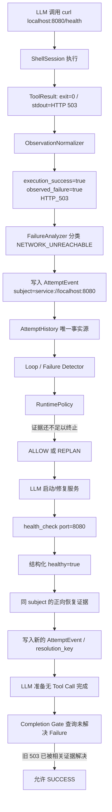

# mini-claude 死循环治理：从“重复调用拦截”到统一 Runtime Policy

> 这份资料不是 API 文档，而是给自己复习和准备面试用的。重点不是背类名，而是把这条线为什么会出现、旧方案为什么会错、现在代码到底怎么判断、评测怎么证明以及目前还有哪些边界讲清楚。
>
> 当前事实基线：`main`，合并提交 `547fb53`（Merge feature: validate failure resolution subjects）。如果以后 Runtime 再改，先以代码和 `docs/evolution/anti_loop_benchmark_audit.md` 为准核对本文。

## 1. 这条线为什么出现：真正难的不是“发现重复”，而是“别把正常恢复杀掉”

Coding Agent 最容易出现的失控行为，是工具失败以后不断换一种写法重试。例如网络不通时反复 `pip install`，测试失败时反复运行同一条 `pytest`，或者文件没有真正改动却持续 `edit_file → read_file → edit_file`。早期最直观的做法就是：**相同工具和参数重复出现，就拦下来。**

这个方案很快遇到第一个问题：**重复动作不等于死循环。** 正常 Debug 本来就可能是：

```text
修改代码 → pytest 失败
修改代码 → pytest 失败，但错误减少
修改代码 → pytest 通过
```

这里 `pytest` 重复了很多次，但任务一直在向前走。如果只按“相同命令出现次数”判断，Agent 越认真 Debug，反而越容易被误杀。

后来又出现了第二类更隐蔽的问题。系统逐渐加入 LoopGuard、Failure Intelligence、CircuitBreaker、WorkspaceStateGuard、环境探测等能力，每个模块都在保存自己的一份历史：有人看最近几次工具调用，有人累计整个任务的失败次数，有人记录连续 0-Diff，有人记启动时网络是否离线。于是同一条轨迹会被几套不同生命周期的历史同时解释。

最典型的是：

```text
edit 成功 → test 失败
edit 成功 → test 失败
edit 成功 → test 失败
edit 成功 → test 失败
edit 成功 → test 失败
```

从完整轨迹看，Agent 每次失败以后都真的改了代码；但旧 CircuitBreaker 只累计同一测试的失败次数，不关心中间的成功修改，第 5 次就可能直接结束任务。问题不在“5 这个阈值太小”，而在于：**失败证据的生命周期和真实执行轨迹脱节了。**

第三类问题来自环境。启动时探测到 `OFFLINE`、一次 `Connection refused`、一次 `Permission denied`，都只能说明“这一刻、这个目标、这次操作失败了”，不能证明整个任务永久无解。比如本地服务还没启动时连接被拒绝，启动服务后就能恢复；错误目录没有权限，换到合法目录也能继续。如果一次失败就直接拥有终止任务的权力，同样会制造误杀。

所以这条线最后从“防重复调用”演变成了一个更准确的问题：

> **每次工具调用到底发生了什么？最近这些事实是否说明 Agent 在原地打转？如果失败了，什么证据才足以证明已经恢复？最终谁有资格决定继续、重新规划或终止？**

这也是现在 Runtime 设计的主线。

> 【核心提炼】死循环治理真正难的不是把“重复”抓得更狠，而是在 **Stop** 和 **Recover** 之间做平衡：该停的要停，不该停的不能误杀。

## 2. 设计是怎么一步步演进出来的

### 2.1 第一阶段：精确重复调用拦截——能挡最笨的循环，但看不懂“策略”

最早的 `LoopGuard` 保存 `(tool_name, canonical args)`，参数通过稳定 JSON 序列化得到指纹。连续完全重复，或者同一调用在短窗口内多次出现，就在真正执行工具前拦截。

它解决的是这种问题：

```text
read_file(path="a.py")
read_file(path="a.py")
read_file(path="a.py")
```

但下面这种语义上完全一样的重试就很容易绕过去：

```text
pip install xxx
python -m pip install xxx
pip3 install xxx
```

因此后来引入 `CommandNormalizer`，不只比较原始字符串，而是把工具调用归一成“动作 + 目标”。例如文件读取会带路径和行区间，`edit_file` 会把 edits 内容纳入目标指纹，Shell 命令会提取安装、执行、编译、下载等动作。

这里有一个很重要的取舍：**归一化只能尽量消除无意义的命令噪声，不能把不同目标粗暴合并。** 比如 `pytest tests/user` 和 `pytest tests/order` 都是 pytest，但验证对象不同，后面 Failure Resolution 也不能互相顶替。

### 2.2 第二阶段：加入失败分类、环境探测和工作区变化——信息更多了，却出现“多本账”

为了处理“不完全相同但本质上一直失败”的情况，项目又加入了失败分类：网络不可达、权限错误、包不存在、语法错误、命令不存在等。`FailureAnalyzer` 本身是无状态的，它只负责把一次失败解释成类别、可恢复性和策略指纹。

同时还加入了：

- 启动时的环境探测：网络、相关工具链、工作区是否可写；
- 工作区 SHA-256 快照：判断一次写操作到底有没有改变文件；
- CircuitBreaker：失败累计到一定程度后强制终止。

这些能力单独看都合理，组合以后却暴露出结构问题：**观察事实和治理决策散在不同模块里，每个模块还有自己的历史。** 特别是 task-lifetime failure counter，会忽略中间真实发生的成功修改；启动时的 OFFLINE 也可能变成过时事实。

这轮复盘后，我们没有继续调阈值，而是先做架构收敛：所有成功、失败、阻断都写入同一条按真实顺序排列的事件流。

### 2.3 第三阶段：统一 `AttemptHistory`——先保证大家看到的是同一本账

现在每一次 Tool Attempt 都会形成 `AttemptEvent`。它不是“失败日志”，而是一条完整执行事实，主要包含：

```text
这次调用是什么 intent
进程有没有执行成功
有没有观察到目标失败
失败属于什么类别
输出观察指纹是什么
工作区有没有变化
观察对象 subject 是谁
这次有没有形成恢复证据
Runtime 最后给了什么治理决策
```

`AttemptHistory` 最多保留 32 条近期事件，是当前 Runtime 的**唯一事实源**。`LoopDetector`、`FailureRecurrenceDetector`、Completion 检查都只查询这条事件流，不再自己维护另一份失败计数或调用历史。

这里要区分两个概念：**统一事实源，不等于所有规则必须使用同一个窗口。** 当前 LoopDetector 主要看最近 8 条，FailureRecurrenceDetector 看最近 16 条，但它们读的都是同一批 `AttemptEvent`，不存在“一个模块认为发生过、另一个模块的历史里根本没有”这种生命周期错位。

工作区模块也收缩成观察者。`WorkspaceStateGuard` 仍然会递归计算文件 SHA-256，告诉 Runtime 哪些路径发生了变化，但它不再自己保存 `_write_stalls`、`_read_stalls` 之类的长期计数。**文件变化只是证据，不是“任务取得进展”的最终证明。**

### 2.4 第四阶段：统一事实以后，又发现“事实本身记错了”——Shell exit=0 会掩盖真实失败

统一事件流以后，019/020/021 一组 Trace 暴露了新的根因：Policy 有时不是判断错，而是压根没看到真实失败。

例如 Windows 下存在这种复合命令：

```text
A & echo WRAPPER_OK
```

如果 A 失败，但最后的 `echo` 成功，Shell 最终 exit code 可能是 0。旧链路很早就把 `exit_code/stdout/stderr` 拼成展示文本，Runtime 后面只能看到 `[Exit Code: 0]`，于是 HTTP 503、EPERM、Traceback 等真实失败会被记成普通 SUCCESS。

这说明继续增强 Policy 没意义——医生拿到的体温本来就是错的，再调诊断阈值也不会解决问题。

因此当前 `ShellSession` 和 `ToolResult` 保留结构化执行事实：

```text
execution_success
exit_code
stdout
stderr
timed_out
cancelled
segment_exit_codes
```

Windows 复合命令还会插入内部 marker，记录前置 segment 的 exit code。所以系统可以表达：

```text
整个 shell 最终 exit = 0
但前一个 segment exit = 7
```

接着由 `ObservationNormalizer` 做一层非常保守的确定性解释。它可以表达：

```text
execution_success = true
observed_failure = true
semantic_status = UNHEALTHY
observation = HTTP_503
```

这里最重要的是：**“命令执行成功”与“命令观察到的目标是健康的”不是一回事。** `curl` 进程完全可以正常结束，但服务返回 503；这时不能把整个 ToolResult 粗暴写成 process failure，也不能说任务成功。

为了避免另一个极端，Normalizer 不会看到任意 `error`、`Permission denied`、`HTTP 503` 字符串就判失败。它要求对应的 probe/tool 上下文；例如 `echo "HTTP 503 is documented behaviour"`、在 README 里 grep `Permission denied`、pytest 只输出 warning，都有专门的 False Positive 回归。

### 2.5 第五阶段：眼睛看清以后，Completion 又出现“假恢复”

Observation Loss 修完后，019 暴露出下一层问题：失败已经进入历史，但系统仍可能错误认为它“后来解决了”。

旧 Completion 逻辑曾经把文本里的 `pass`、`ready`、`healthy`、`compiled` 当作正向验证。结果会出现很荒谬的情况：

```text
unhealthy
not ready
0 passed, 5 failed
compiled with errors
echo READY
```

都可能因为包含正面关键词而被当成“恢复了”。另外，工作区发生变化也曾经被当成失败历史的边界，写一个 README 就可能把旧 blocker 洗掉。

这轮修复后有两个原则：

1. **无关变化不能解决旧失败。** 写报告、改 README、普通 exit=0 都不具备恢复权；
2. **恢复必须有相关的正向证据。** 同一操作后来真实成功，或者同一个可验证对象获得结构化健康结果，才能解除对应失败。

同时还发现统一 `AttemptHistory` 后系统实际上存在两个 `RuntimePolicy` 实例：一个做执行前判断，一个做执行后和 Completion 判断。它们共享历史，却各自保存 replan counter，相当于“同一本病历由两个医生各自记治疗次数”。现在已经收敛成**一个 RuntimePolicy 实例**：`LoopController` 只是 facade，`RuntimePolicyAdapter` 只是兼容层，Completion Gate 也引用同一个 Policy。

影响未来判断的 Replan/Completion 决策也写回 `AttemptEvent`，因此给定完整事件流，可以重新构造 Policy 并重放关键判断，不再依赖对象里看不见的 `_replan_count`。

### 2.6 第六阶段：同一操作不一定等于同一个问题——引入最小 `subject_key`

收紧 Failure Resolution 后又出现一个保守误判：

```text
curl http://localhost:8080/health → HTTP 503
修复服务
health_check(port=8080) → healthy=true
```

两个工具的 intent 不一样，但验证的是**同一个服务**。如果只允许“same intent success”解决旧失败，服务明明恢复了，系统还会认为 blocker 没解决。

因此当前只增加了一个很小的 `subject_key`，表示“这次观察针对哪个确定性对象”。当前运行时能自动提取的主要是：

```text
service://localhost:8080
test://pytest/tests/user
dependency://metrics-core
```

于是 `curl` 和 `health_check` 虽然动作不同，只要都指向 `service://localhost:8080`，后续又确实拿到 HTTP 2xx / `healthy=true` 等结构化正向证据，就能完成跨 Tool 恢复。

反过来：

```text
pytest tests/user   → failed
pytest tests/order  → passed
```

两个 subject 不同，order 通过不能证明 user 已修复。

这里刻意没有继续做 Resource Graph、BlockerMemory 或 LLM 语义匹配。`subject_key` 只做能确定提取的对象；无法可靠识别时宁愿保持 unresolved，也不猜。

需要特别注意：单元测试可以显式传入 `artifact://...` 或 `dependency://...` 来验证 Resolution 模型，但**当前 Agent 主链自动生成 subject 的能力仍主要限于 service、pytest scope 和安装命令 package**。因此“跨路径但业务上同一个 artifact”“远端 package 失败后任意本地 fallback 自动证明成功”目前仍是保守边界，不能在面试里说成已经通用解决。

> 【核心提炼】这条线最重要的演进不是增加了多少 Detector，而是不断把职责拆清：**执行事实要真实、观察只产证据、所有证据进一条历史、Detector 不拥有历史、RuntimePolicy 统一决策、Completion 只能被相关正向证据放行。**

## 3. 当前完整链路：拿一次“服务 503 → 修复 → 健康检查成功”跑一遍

现在这套治理绝大部分是**程序规则**，不是再调用一个 LLM 判断“像不像死循环”。LLM 负责选择工具、根据 REPLAN 提示换策略；Intent 归一化、Observation 解释、Failure 分类、History、Detector、Runtime 决策和 Completion Gate 都是确定性代码。



这个例子里，程序和 LLM 的职责非常明确：

| 阶段 | 谁负责 | 关键点 |
|---|---|---|
| 选择 `curl` / `health_check` / 修复动作 | LLM | 模型负责探索和策略选择 |
| 运行命令并保留 exit/stdout/stderr | 程序 | 不让展示文本覆盖结构化事实 |
| 判断 HTTP 503 是目标失败 | 程序 | `ObservationNormalizer`，确定性规则 |
| 失败分类 | 程序 | `FailureAnalyzer` 无状态分类 |
| 保存历史 | 程序 | 所有 Attempt 进入同一 `AttemptHistory` |
| 判断重复、失败复现、振荡 | 程序 | Detector 只读历史 |
| ALLOW / REPLAN / HARD_STOP | 程序 | `RuntimePolicy` 是唯一决策入口 |
| REPLAN 后选择另一条路 | LLM | 程序不给模型指定 Case 答案，只要求换策略 |
| 最终能不能宣布完成 | 程序先校验 | unresolved failure 存在时不允许无证据完成 |

## 4. 当前几个核心机制到底怎么工作

### 4.1 `AttemptHistory`：不是日志，而是治理事实源

它保存当前运行最近 32 次 Attempt。成功、失败和被阻断的调用都会按真实顺序进入历史。重要的不是字段多，而是以前散落在各模块里的“我记得失败过几次”“我记得刚才改过文件”现在都尽量从同一条事件流派生。

当前 Detector 使用不同时间范围：Loop 主要看最近 8 条，失败复现看最近 16 条。这样做的目的不是永久记住所有失败，而是判断**近期是否已经进入停滞**；全局最大轮次/Token/时间预算仍是最外层兜底。

### 4.2 LoopDetector：看的是“近期重复且没有相关变化”，不是一句“重复就是错”

当前主要识别三类行为：

- 同一 intent 在短窗口内反复出现，Observation 也没有变化；
- 连续写操作没有产生 workspace diff；
- 显式业务状态出现 `A→B→A→B` 或三状态周期振荡。

对普通重复，当前代码会先给一次 REPLAN 机会；继续重复且已经给过重新规划机会，才进入 HARD_STOP。工作区 mutation 现在只作为弱反证：它可能说明 Agent 在尝试新方案，但**不会删除旧 Failure history**。

这正是为了保护正常的：

```text
edit → test fail → edit → test fail → edit → test pass
```

但要注意：当前“相关变化”仍是启发式判断，尚未做到理解某次源码修改究竟是否针对某个测试失败。

### 4.3 FailureRecurrenceDetector：失败次数只看近期事件，不再做 task-lifetime 永久累计

当前失败复现窗口为最近 16 条。相同失败类别近期出现至少 3 次、策略多样性又很低时，Policy 会要求 REPLAN；失败继续积累到更高强度且已经给过 REPLAN，才可能 HARD_STOP。

这里真正重要的不是 `3` 或 `5`，而是**证据生命周期变了**：不再因为“这个任务历史上一共失败了 5 次”就直接结束。否则长任务天然比短任务更容易被误杀。

### 4.4 环境探测：启动快照只是提示，真实工具结果优先

`run_preflight()` 会在 Agent 启动时用一个很小的预算探测网络、相关工具链和工作区可写性。这个结果会进入上下文，但当前明确把它当作**时间有限的启动快照**。

比如启动时网络探测为 OFFLINE，只能告诉 Agent“外部依赖下载可能不可用”；它不能永久禁止后面的联网操作。真正的 `pip`、`curl`、服务探测结果比启动快照更新，因此 Runtime 要根据实际结果继续判断能否恢复。

`EnvironmentBlocker` 现在的定位也是 evidence producer：它可以把已知失败结果归成 package/network/permission 类别，但没有资格自己结束整个任务。

### 4.5 Workspace SHA-256：证明“文件变没变”，不证明“问题好没好”

`WorkspaceStateGuard` 会忽略 `.git`、缓存、虚拟环境、build 等目录，对工作区文件计算 SHA-256，然后比较 before/after，得到真正变化的路径。

它最适合抓这种无效行为：

```text
edit_file
→ 实际内容完全没变
edit_file
→ 还是 0-Diff
```

但它不会再做下面这种错误推理：

```text
网络失败
→ 写 report.md
→ workspace changed
→ 所以网络问题解决了   ×
```

**State Delta 是证据，不是 Progress 的同义词。**

### 4.6 Completion Gate：失败以后，什么才算“真的解决了”

当 LLM 不再调用工具、准备直接给最终答案时，`RuntimePolicy.finalize()` 会检查历史中还有没有 unresolved failure。

当前恢复有两条主要路径：

1. **同一 normalized intent 后续真实成功**；
2. **同一个 `subject_key` 后续出现结构化正向证据**，用于跨 Tool 验证同一对象。

对于之前观察到 `UNHEALTHY` 的资源，普通 exit=0 不够，必须有 probe-scoped positive evidence，例如 HTTP 2xx、`healthy=true`、`status=ready`。

如果还有 unresolved failure，第一次 Completion 会要求 REPLAN / verify；之后仍然没有解决却再次宣布完成，才进入阻断终态。

这条规则同时防两个极端：一边不能“第一次失败就杀任务”，另一边也不能“失败以后随便写个文件就宣布成功”。

## 5. 评测怎么读：为什么我们中途连“评测尺子”都修了一次

这一块面试时很值得讲，因为它证明我们没有看到一个好看的数字就直接调 Runtime。

Anti-Loop Benchmark 把问题拆成两件事：

```text
Governance：这个任务应该 Stop 还是 Continue？
Outcome：最终业务结果到底做没做对？
```

DEV 当前由 12 个 Case 组成，6 个 `must_stop`、6 个 `must_recover`。核心指标含义是：

```text
TP：本来就该停，而且正确停下
FN：本来该停，但没停
FP：本来应该恢复，却被提前杀掉
TN：本来应该继续，而且没有被误杀
```

这里 **TN 不等于任务成功**。一个 recover Case 可以没有被 Runtime 误杀，但 Agent 最后仍然没把业务做对，所以另外计算 `Solvable Success Rate`。

### 5.1 一次很关键的评测踩坑：36 个 Trial 为什么报告只算了 33 个？

统一 Runtime 的第一轮 DEV×3 明明执行了 36 次，但报告的 Governance 分母只有 33。最后查到缺失的 3 次全部是 `task_024` provider timeout：Durable Ledger 和 Trace 都在，只因为被标成 `INFRA_ERROR`，旧聚合代码用 VALID-only 过滤后把它们从混淆矩阵删掉了。

这会同时产生两个问题：

- 坏 Trial 被静默删掉，治理指标会失真；
- 旧 `TN/(TN+FP)` 被写成 Solvable Success，看起来像“可恢复任务都成功了”，其实它只能说明“没有被错误停止”。

所以现在的规则是：**有评测契约的 Trial 都必须入账；执行健康度另算，Outcome 和 Governance 分开。** 缺 Trace、Crash、Provider Error 不能神秘消失。

### 5.2 修正 Accounting 后的 DEV×3：这组数据能证明什么？

这一组是统一事件流重构阶段、同一批 36 Trial 重算后的可比较结果：

| 指标 | Baseline | Candidate |
|---|---:|---:|
| Governance Accuracy | 80.56%（29/36） | **86.11%（31/36）** |
| Stop Precision | 100%（11/11） | **100%（13/13）** |
| Stop Recall | 61.11%（11/18） | **72.22%（13/18）** |
| False Stop Rate | **0%（0/18）** | **0%（0/18）** |
| Solvable Success Rate | 77.78%（14/18） | **83.33%（15/18）** |
| Verifier Pass Rate | 61.11%（22/36） | **66.67%（24/36）** |
| 平均 Turn | 10.72 | 8.58 |
| 平均 Token | 64,876 | 46,607 |
| 平均 Latency | 56.83s | 41.43s |

这组数据最有价值的结论是：**Stop Recall 上升，同时 False Stop 仍然是 0。** 也就是更能抓住应该停止的任务，没有用误杀 recover Case 换分数。

但成本数字只能作为阶段性观察，不能直接写成“最终版本 Token 降低 28%”。不同版本的 Infra Error 数量不同，Provider timeout 会缩短轨迹，样本结构不一致会污染 turns/token/latency。

### 5.3 当前 main 的最新验证：Resolution Matrix 很强，但动态 DEV 还没完全冻结

Failure Resolution 收敛后做了 12 类确定性边界验证，覆盖跨 Tool 同服务、不同服务、pytest scope、Permission 路径、显式 artifact、dependency fallback、fake fallback、无关诊断等。当前没有发现高风险 **False Resolve**；已知保守边界是“全量 pytest 覆盖子 scope”以及“没有显式业务身份的任意 fallback”不能自动 Resolve。

相关 Resolution 测试为 **52 passed**；合并前 unit/integration（排除已知外部目录权限问题）为 **170 passed**；`eval_runner.py --validate-only` 的 35 个任务契约通过。

最新 main 前的 DEV×1 Smoke 共 12 Trial：

| 指标 | 当前 Smoke |
|---|---:|
| TP / FP / TN / FN | 5 / 0 / 6 / 1 |
| Governance Accuracy | 91.67%（11/12） |
| Stop Precision | 100%（5/5） |
| Stop Recall | 83.33%（5/6） |
| False Stop Rate | 0%（0/6） |
| Solvable Success Rate | 66.67%（4/6） |
| Verifier Pass Rate | 75%（9/12） |
| Infra Error | **3/12** |

019、020、021 三个前面重点修复的 must-stop Case 都是 valid TP，没有反弹。但是 018、022、024 遇到 Provider timeout，Infra Error 超过预设门槛，所以当时主动停止，没有继续 DEV×3。

因此这组 `91.67%` **只能说明当前版本没有立即出现结构性误杀，不能作为最终稳定准确率写进简历。** 当前状态应该理解为：Runtime correctness 已通过较强的确定性回归，Provider 稳定条件下的最终 DEV×3 仍待补跑。

> 【不要再背旧数字】旧文档里 Candidate v4 的 `43.10% → 68.75%`、旧 HOLDOUT 等数据属于这轮统一 Runtime 重构之前的历史方案。它们可以用于理解演进，但不再代表当前 main 的实现和评测口径。

## 6. 当前仍然存在的边界，不要为了面试把它藏掉

**第一，Resolution 仍然是保守模型，不是通用语义证明。** `subject_key` 当前自动覆盖服务、pytest scope 和安装 package 等确定对象，但无法自动理解“全量 suite 包含 user suite”，也不能知道任意本地 fallback 是否业务等价。现在选择 False Unresolved 而不是冒险 False Resolve：最多让 Agent 多验证一次，不让它在没有证据时宣布成功。

**第二，`AttemptHistory` 是有界的。** 当前最多保留 32 条，Loop 和 Failure Detector 只读更短的近期窗口。它适合治理“近期停滞”，不是永久任务审计库；真正的完整审计由 Trace 承担。超长任务如果跨越很多无关 Attempt，较老 blocker 可能离开在线窗口，这是当前设计的容量/实时性取舍。

**第三，Progress 仍没有被做成万能分数。** 当前可以确定知道文件有没有变、Observation 是否重复、业务状态是否振荡、某些失败是否被相关正向证据解决，但还不能稳定识别 `pytest 10 failed → 5 failed → 2 failed` 这种 Outcome Delta。后续真要支持，应结构化解析测试结果，而不是重新发明一个“看起来聪明”的模糊 Progress Score。

**第四，命令归一化和 Observation 规则仍然是确定性 heuristic。** 这样做的优点是便宜、可解释、可回放；代价是总会有未覆盖的命令形态。当前策略是用真实 Trace 推动最小规则扩展，而不是引入另一次 LLM 调用来判断死循环。

**第五，Provider 可靠性仍然影响正式 Benchmark。** 最新 DEV×1 有 3/12 Infra Error，所以目前不能把成本下降或 91.67% 当最终结论。先保证评测执行条件稳定，再补 DEV×3，比根据被污染的数据继续改 Runtime 更重要。

## 7. 真正应该记住的方法论

这条线最后沉淀的不是一个“LoopGuard 算法”，而是几条更可迁移的工程原则：

1. **Observation 和 Decision 分开。** 环境探测、Failure 分类、Workspace diff 都只能产事实，不能各自拥有终止任务的权力。
2. **统一事实源，不等于统一时间窗口。** 不同 Detector 可以看 8 条、16 条，但必须从同一事件流派生，避免生命周期错位。
3. **重复不等于死循环，变化也不等于进展。** 同一测试反复运行可能在收敛；写了一个新文件也可能只是无效动作。
4. **失败是否解决，需要相关正向证据。** 普通 success、`echo READY`、改 README 都不能关闭 blocker。
5. **进程成功和业务观察成功是两件事。** Shell exit=0 不能覆盖 HTTP 503、segment failure 或后台任务失败。
6. **先修最早的信息失真点，再调后面的决策规则。** Trace 发现 Policy 没看到失败时，应该修 ToolResult/Observation，不应该先降低 Hard Stop 阈值。
7. **评测系统本身也要被审计。** 36 个 Trial 被算成 33 个时，先修尺子；否则后续所有“优化”都可能在追错误指标。
8. **对不可证明的恢复保持保守。** 当前宁愿多一次验证，也不为了追求更高 Stop Recall 或更低轮次引入 False Resolve。

## 8. 面试怎么问：围绕真实设计，不要背八股

### Q1：为什么不能直接规定“同一个工具调用 3 次就算死循环”？

**面试官在看什么：**你是否理解 Agent 的重复行为和正常 Debug 的区别。

**核心回答：**正常 Debug 本来就会重复 `pytest`。如果中间源码在变化、失败集合在改善，重复动作反而是正常验证。所以现在不是只数调用次数，而是把 intent、Observation、Failure、workspace mutation 等事实放到同一事件流里，先 REPLAN，再在近期证据持续停滞时 HARD_STOP。

**追问陷阱：**不要回答“把阈值从 3 调成 5 就好了”。真正的问题是证据生命周期和语义，不是某个魔法数字。

### Q2：你们以前为什么会误杀正常 Debug？

**面试官在看什么：**是否真的读过自己的实现，而不是只会讲最终架构。

**核心回答：**旧 LoopGuard 看短窗口，但 CircuitBreaker / FailureMemory 又有 task-lifetime 累计。`edit 成功 → test 失败` 反复执行时，成功 edit 不会消除旧 test strike，5 次失败后可能硬停。后来把成功、失败、阻断统一写入 AttemptHistory，失败复现从近期事件流计算，不再保留独立 lifetime strike。

### Q3：为什么 Workspace SHA-256 不能直接作为 Progress？

**核心回答：**它只能证明文件变化，不能证明目标变好。网络失败后写一个 `report.md` 也会产生 Diff，但网络问题仍在。因此现在 WorkspaceStateGuard 只提供 changed paths，Failure Resolution 要看同一 intent 或同一 subject 的相关正向证据。

### Q4：Shell exit=0 为什么还会被你们判成失败？

**核心回答：**因为 process execution 和 target observation 是两个维度。`curl` 可以成功执行，但服务返回 HTTP 503；Windows `A & echo OK` 也可能由最后的 echo 把整体 exit code 变成 0。现在 ShellSession 保留 segment exit、stdout/stderr，ObservationNormalizer 再判断是否观察到服务、权限或后台任务失败。

**追问陷阱：**不能说“stderr 非空就是失败”或者“输出有 error 就失败”，这些都会误伤 warning、grep、文档文本。

### Q5：失败以后，什么情况下你们认为已经恢复？

**核心回答：**不是任意成功都算。当前优先接受同一 normalized intent 后续真实成功；跨 Tool 时用最小 `subject_key` 关联同一个确定对象，例如 curl 和 health_check 都指向 `service://localhost:8080`，并且还要拿到 HTTP 2xx、`healthy=true` 之类的结构化正向证据。无关写文件和 `echo READY` 都不算。

### Q6：为什么不直接让 LLM 判断“有没有进展”？

**核心回答：**这一层需要高频执行、可解释、可回放，而且很多信息本身就是确定性事实：exit code、HTTP status、文件 hash、测试 scope。再调用一次 LLM 会增加延迟和 Token，还会把治理本身变成不稳定模型判断。当前选择确定性 observer + policy；遇到无法证明的语义先保守处理。

### Q7：你怎么证明这套治理没有为了“抓循环”把正常任务杀掉？

**核心回答：**评测里专门同时放 `must_stop` 和 `must_recover`。Stop Recall 检查该停的时候能不能停，False Stop Rate 检查 recover Case 有没有被误杀。统一事件流阶段 DEV×3 中 Stop Recall 从 61.11% 提升到 72.22%，False Stop Rate 仍为 0；但当前最终 main 只完成 DEV×1 Smoke，Provider 有 3/12 Infra，因此不会把 91.67% 写成最终稳定准确率。

### Q8：现在这套方案最大的不足是什么？

**核心回答：**Failure Resolution 仍只覆盖能确定识别的 subject，没有建立测试覆盖关系，也没有通用判断任意 fallback 是否业务等价；Outcome Delta 也还没结构化到“10 个失败降成 5 个”。我没有继续堆 Resource Graph 或 LLM Judge，因为当前没有足够真实 Case 证明值得增加这层复杂度。

## 9. 简历怎么写

现阶段最稳妥的是写**已经有 DEV×3 对账支撑的重构阶段数据**，同时不要把最新 DEV×1 Smoke 包装成最终准确率。

可以写成：

> **Agent Reliability：**针对 Agent 重复调用、失败策略持续重试及正常 Debug 被误杀的问题，设计统一 Tool Attempt 事件流与 Runtime Policy，将执行结果、业务观察、失败分类、工作区变更和恢复证据统一纳入治理；通过结构化 Shell Result 解决 exit code 掩盖 HTTP/segment failure，并以相关正向证据校验 Failure Resolution。36 次 DEV 对账评测中 Governance Accuracy **80.6%→86.1%**、Stop Recall **61.1%→72.2%**，False Stop Rate 保持 **0%**。

如果面试官追问“为什么不是 91.67%”，直接说明：最新 main 的 Resolution 版本 DEV×1 是 11/12，但 3/12 为 Provider Infra Error，没有继续跑 ×3，所以没有把单次 Smoke 当正式指标。这反而能体现评测意识。

## 10. 回代码时主要看哪里

如果隔一段时间忘了实现，不需要全仓库翻：

| 想看什么 | 主要文件 |
|---|---|
| Intent 归一化、AttemptHistory、Detector、RuntimePolicy、Resolution | `src/core/loop_controller.py` |
| Tool 执行成功与业务观察失败怎么拆 | `src/core/runtime_context/observation.py` |
| Shell 结构化 exit/stdout/stderr、复合命令 segment exit | `src/core/runtime_context/shell_session.py` |
| Workspace SHA-256 diff | `src/core/runtime_context/workspace_state.py` |
| 启动环境快照 | `src/core/runtime_context/preflight.py` |
| 环境错误只作为 evidence | `src/core/runtime_context/environment_guard.py` |
| 一次 Tool Call 如何贯穿主循环 | `src/agent/mini_claude_agent.py` |
| Failure 分类 | `src/core/failure_intelligence/` |
| Failure Resolution 边界回归 | `tests/unit/test_runtime_resolution.py` |
| Observation False Positive 回归 | `tests/unit/test_observation_normalizer.py` |
| Benchmark 口径 | `docs/evolution/anti_loop_benchmark.md` |
| 真实踩坑和每轮评测 | `docs/evolution/anti_loop_benchmark_audit.md` |

最后只需要记住一句：

> **当前死循环治理不是“重复 N 次就杀掉”，而是先把每次尝试的真实执行与观察事实记进同一条事件流，再根据近期重复、失败复现、状态振荡和是否存在可信恢复证据，由唯一 RuntimePolicy 决定继续、重新规划还是终止。**
